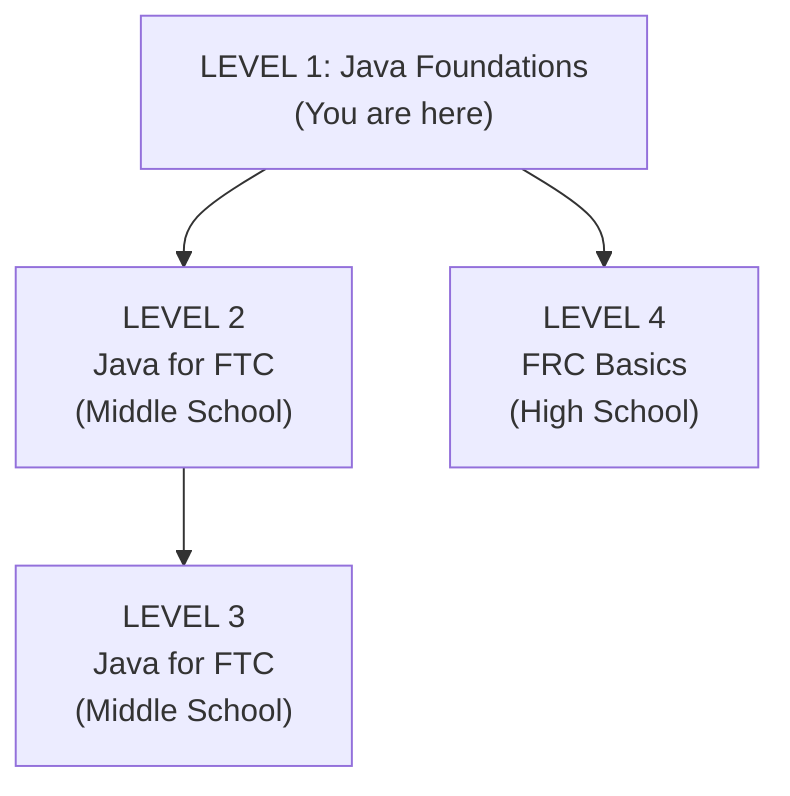

# **Guide to Java \- Level 1: Foundations**

## **Who Is This For?**

Any FIRST student — FTC or FRC — who needs to learn Java basics. No robot code here, just the fundamentals you'll need before touching any robot programming.  
**Prerequisites:** None. Complete beginner friendly.  
**Time to Complete:** 2-4 weeks with daily practice (30-60 min/day)

## **Your Learning Path**



## **How to Use This Guide**

1. **Learn the concepts** — Use Codecademy, a class, videos, or this guide itself  
2. **Type every example** — Don't just read; actually write the code  
3. **Practice with CodingBat** — Short problems build muscle memory  
4. **Ask questions** — If something doesn't make sense, ask\!

## **Part 1: Basic Syntax**

These are the building blocks of every Java program.

### **Variables and Data Types**

Variables store information. Think of them as labeled boxes.

```java
// Whole numbers (no decimals)
int score = 0;
int teamNumber = 3603;

// Decimal numbers
double speed = 0.75;
double distance = 12.5;

// True or false
boolean isRunning = true;
boolean hasFinished = false;

// Text
String teamName = "Cyber Coyotes";
String greeting = "Hello, World!";
```

**The four types you'll use most:** | Type | What It Stores | Example | |------|----------------|---------| | `int` | Whole numbers | `42`, `-7`, `0` | | `double` | Decimal numbers | `3.14`, `-0.5`, `100.0` | | `boolean` | True or false | `true`, `false` | | `String` | Text | `"Hello"`, `"Team 3603"` |

### **Operators**

**Math operators** — do calculations

```java
int sum = 5 + 3;           // Addition: 8
int difference = 10 - 4;   // Subtraction: 6
int product = 6 * 7;       // Multiplication: 42
double quotient = 15.0 / 4.0;  // Division: 3.75

int remainder = 17 % 5;    // Modulo (remainder): 2
```

**Comparison operators** — compare values, return true or false

```java
boolean isEqual = (5 == 5);        // true (equal to)
boolean notEqual = (5 != 3);       // true (not equal to)
boolean greater = (10 > 5);        // true (greater than)
boolean less = (3 < 8);            // true (less than)
boolean greaterOrEqual = (5 >= 5); // true (greater than or equal)
boolean lessOrEqual = (4 <= 4);    // true (less than or equal)
```

**Logical operators** — combine true/false values

```java
boolean both = true && true;    // AND: true (both must be true)
boolean either = true || false; // OR: true (at least one true)
boolean opposite = !true;       // NOT: false (flips the value)

// Real example
int age = 15;
boolean isTeenager = (age >= 13) && (age <= 19);  // true
```

!!! note "Coach"
    <!-- category: common student misconception -->
    **Integer division surprises everyone.** Ask students what `5 / 2` evaluates to. Most say `2.5`. Java gives `2` — integer division discards the decimal. To get `2.5`, at least one operand must be a `double`: write `5.0 / 2` or cast with `(double) 5 / 2`. Let students hit this on their own before explaining it; the surprise makes the rule stick far better than a warning does.

### **Printing Output**

Use `System.out.println()` to display information:

```java
System.out.println("Hello, World!");
System.out.println(42);
System.out.println("My team number is " + 3603);

int score = 100;
System.out.println("Your score: " + score);
```

## **Part 2: Control Flow**

Control flow determines which code runs and when.

### **If/Else Statements**

Make decisions based on conditions:

```java
int score = 85;

if (score >= 90) {
    System.out.println("A grade!");
} else if (score >= 80) {
    System.out.println("B grade!");
} else if (score >= 70) {
    System.out.println("C grade!");
} else {
    System.out.println("Keep practicing!");
}
```

**Common patterns:**

```java
// Simple yes/no decision
if (isReady) {
    System.out.println("Let's go!");
}

// Either/or decision
if (temperature > 80) {
    System.out.println("It's hot!");
} else {
    System.out.println("It's nice out.");
}

// Multiple conditions with AND
if (hasTicket && isOnTime) {
    System.out.println("You can enter.");
}

// Multiple conditions with OR
if (isWeekend || isHoliday) {
    System.out.println("No school today!");
}
```

### **For Loops**

Repeat code a specific number of times:

```java
// Count from 0 to 4
for (int i = 0; i < 5; i++) {
    System.out.println("Count: " + i);
}
// Output: 0, 1, 2, 3, 4

// Count from 1 to 5
for (int i = 1; i <= 5; i++) {
    System.out.println("Number: " + i);
}
// Output: 1, 2, 3, 4, 5

// Count by 2s
for (int i = 0; i <= 10; i += 2) {
    System.out.println(i);
}
// Output: 0, 2, 4, 6, 8, 10
```

**Breaking down the for loop:**

```java
for (int i = 0; i < 5; i++) {
//   ^^^^^^^^   ^^^^^   ^^^
//   Start at 0 Stop before 5  Add 1 each time
}
```

### **While Loops**

Repeat code while a condition is true:

```java
int count = 0;

while (count < 5) {
    System.out.println("Count: " + count);
    count = count + 1;  // Don't forget this or it loops forever!
}
```

**When to use which:**

* **For loop:** When you know how many times to repeat  
* **While loop:** When you repeat until something changes

!!! note "Coach"
    <!-- category: let them fail here -->
    **Let them write an infinite loop on purpose.** Have students write a while loop that counts up but forget to include the increment (`count = count + 1`). Let the program hang. Then show them Ctrl+C (or the IDE stop button) to recover. Making the program freeze once is worth more than ten warnings. After the experience, the rule — "always change the variable the condition depends on" — is obvious instead of arbitrary.

## **Part 3: Methods**

Methods are reusable blocks of code. They help you organize and avoid repetition.

### **Methods That Do Something**

```java
// A simple method that prints a greeting
public void sayHello() {
    System.out.println("Hello!");
}

// A method with a parameter (input)
public void greet(String name) {
    System.out.println("Hello, " + name + "!");
}

// A method with multiple parameters
public void introduce(String name, int age) {
    System.out.println("I'm " + name + " and I'm " + age + " years old.");
}
```

**Calling methods:**

```java
sayHello();                    // Prints: Hello!
greet("Alex");                 // Prints: Hello, Alex!
introduce("Jordan", 15);       // Prints: I'm Jordan and I'm 15 years old.
```

### **Methods That Return Values**

```java
// Returns a number
public int add(int a, int b) {
    return a + b;
}

// Returns a decimal
public double average(double x, double y) {
    return (x + y) / 2.0;
}

// Returns true or false
public boolean isEven(int number) {
    return (number % 2) == 0;
}

// Returns text
public String getGreeting(String name) {
    return "Hello, " + name + "!";
}
```

**Using return values:**

```java
int sum = add(5, 3);                    // sum = 8
double avg = average(90.0, 80.0);       // avg = 85.0
boolean even = isEven(4);               // even = true
String message = getGreeting("Sam");    // message = "Hello, Sam!"

// You can also use them directly
System.out.println(add(10, 20));        // Prints: 30
if (isEven(7)) {
    System.out.println("It's even!");
}
```

### **Method Naming**

Use verbs that describe what the method does:

```java
// Good names - clear what they do
public void startMotor() { }
public void stopMotor() { }
public double calculateDistance() { }
public boolean isFinished() { }

// Bad names - unclear
public void doStuff() { }
public void thing() { }
public int x() { }
```

!!! note "Coach"
    <!-- category: real-robot demo opportunity -->
    **Naming habits compound.** The method names here (`startMotor()`, `calculateDistance()`, `isFinished()`) are exactly what students will write in Level 2 and beyond. Show students a snippet of real team code and ask them to read the method calls aloud: `intake.extend()`, `arm.goToScore()`, `drivetrain.stop()`. A subsystem whose method names read like match instructions is a well-designed subsystem. Start building that vocabulary now; it costs nothing and pays off for years.

## **Part 4: Classes and Objects**

This is where Java gets powerful. Classes let you create your own types.

### **What's a Class?**

A **class** is a blueprint. An **object** is a thing built from that blueprint.  
Think of it like this:

* **Class:** A recipe for chocolate chip cookies  
* **Object:** An actual cookie you baked using that recipe

You can make many cookies (objects) from one recipe (class).

### **Creating a Simple Class**

```java
public class Dog {
    // Fields (what the dog HAS)
    String name;
    int age;
    
    // Constructor (how to create a dog)
    public Dog(String dogName, int dogAge) {
        name = dogName;
        age = dogAge;
    }
    
    // Methods (what the dog can DO)
    public void bark() {
        System.out.println(name + " says: Woof!");
    }
    
    public void describe() {
        System.out.println(name + " is " + age + " years old.");
    }
}
```

### **Creating and Using Objects**

```java
// Create two Dog objects
Dog myDog = new Dog("Buddy", 3);
Dog yourDog = new Dog("Max", 5);

// Use their methods
myDog.bark();        // Prints: Buddy says: Woof!
yourDog.bark();      // Prints: Max says: Woof!

myDog.describe();    // Prints: Buddy is 3 years old.
yourDog.describe();  // Prints: Max is 5 years old.
```

### **A More Practical Example**

```java
public class BankAccount {
    // Fields
    String ownerName;
    double balance;
    
    // Constructor
    public BankAccount(String name, double startingBalance) {
        ownerName = name;
        balance = startingBalance;
    }
    
    // Methods
    public void deposit(double amount) {
        balance = balance + amount;
        System.out.println("Deposited $" + amount);
    }
    
    public void withdraw(double amount) {
        if (amount <= balance) {
            balance = balance - amount;
            System.out.println("Withdrew $" + amount);
        } else {
            System.out.println("Not enough money!");
        }
    }
    
    public double getBalance() {
        return balance;
    }
}
```

```java
// Using the BankAccount class
BankAccount myAccount = new BankAccount("Alex", 100.0);

myAccount.deposit(50.0);     // Deposited $50.0
myAccount.withdraw(30.0);    // Withdrew $30.0
myAccount.withdraw(200.0);   // Not enough money!

System.out.println("Balance: $" + myAccount.getBalance());  // Balance: $120.0
```

### **Public vs Private**

Control what other code can access:

```java
public class Student {
    // Private: only this class can access directly
    private String name;
    private int grade;
    
    public Student(String studentName, int studentGrade) {
        name = studentName;
        grade = studentGrade;
    }
    
    // Public: other code can use these methods
    public String getName() {
        return name;
    }
    
    public int getGrade() {
        return grade;
    }
    
    public void setGrade(int newGrade) {
        // Can add validation here
        if (newGrade >= 0 && newGrade <= 100) {
            grade = newGrade;
        }
    }
}
```

**Why use private?**

* Protects data from being changed incorrectly  
* Lets you add rules (like grade must be 0-100)  
* Makes code easier to change later

!!! note "Coach"
    <!-- category: common student misconception -->
    **Encapsulation is the idea, not just the syntax.** Students often think `private` is about security. The real point is **one class owns one thing**. A `Student` class owns grade data and enforces its own rules about it — nothing outside can corrupt it. In Level 4, this same principle appears as subsystems: a drivetrain subsystem owns its motors and nobody else touches them directly. Students who understand *why* private exists will write better subsystems without having to re-learn the concept.

## **Part 5: Arrays**

Arrays store multiple values of the same type.

### **Creating Arrays**

```java
// Create an array with specific values
int[] scores = {85, 92, 78, 90, 88};

// Create an empty array of size 5
double[] measurements = new double[5];

// Fill it in later
measurements[0] = 1.5;
measurements[1] = 2.3;
measurements[2] = 1.8;
// measurements[3] and [4] are 0.0 by default
```

### **Accessing Array Elements**

```java
int[] scores = {85, 92, 78, 90, 88};

// Access by index (starts at 0!)
int first = scores[0];    // 85
int second = scores[1];   // 92
int last = scores[4];     // 88

// Change a value
scores[2] = 80;           // Was 78, now 80

// Get array length
int size = scores.length; // 5
```

⚠️ **Common mistake:** Arrays start at index 0, not 1\!

### **Looping Through Arrays**

```java
int[] scores = {85, 92, 78, 90, 88};

// Using a for loop with index
for (int i = 0; i < scores.length; i++) {
    System.out.println("Score " + i + ": " + scores[i]);
}

// Using a for-each loop (simpler when you don't need the index)
for (int score : scores) {
    System.out.println("Score: " + score);
}
```

### **Common Array Operations**

```java
int[] numbers = {5, 2, 8, 1, 9};

// Find the sum
int sum = 0;
for (int num : numbers) {
    sum = sum + num;
}
System.out.println("Sum: " + sum);  // Sum: 25

// Find the maximum
int max = numbers[0];
for (int num : numbers) {
    if (num > max) {
        max = num;
    }
}
System.out.println("Max: " + max);  // Max: 9

// Find the average
double average = (double) sum / numbers.length;
System.out.println("Average: " + average);  // Average: 5.0
```

---

## **Capstone: `MatchScorer`**

You've learned variables, control flow, methods, classes, and arrays. Now combine them into a complete program.

**The task:** Write a `MatchScorer` class that tracks a robot's performance in one match and prints a score breakdown. No robot hardware — pure Java.

**Concepts it uses:**

- Private fields and a constructor (Part 4)
- Constants instead of magic numbers (Part 1)
- A method that loops through an array to compute a total (Parts 3 + 5)
- A conditional return (Part 2)

### **`MatchScorer.java`**

```java
public class MatchScorer {

    // Point values for each reef level (teleop scoring, 2025 Reefscape rules).
    // Keep constants together — when the game changes, there is exactly one place to update.
    private static final int L1_POINTS = 2;
    private static final int L2_POINTS = 3;
    private static final int L3_POINTS = 4;
    private static final int L4_POINTS = 5;
    private static final int CLIMB_POINTS = 12;

    private String teamName;
    private int[] coralPerLevel;  // index 0 = Level 1 reef, index 3 = Level 4 reef
    private boolean climbed;

    // Constructor — one MatchScorer per team per match
    public MatchScorer(String teamName) {
        this.teamName = teamName;
        coralPerLevel = new int[4];  // all zeros by default
    }

    // Record coral scored at a reef level (valid levels: 1–4)
    public void recordCoral(int level, int count) {
        if (level >= 1 && level <= 4) {
            coralPerLevel[level - 1] += count;  // convert 1-based level to 0-based array index
        }
    }

    public void setClimbed(boolean didClimb) {
        climbed = didClimb;
    }

    // Loop through each level, multiply coral count by that level's point value, sum them up
    public int coralScore() {
        int[] pointsPerLevel = {L1_POINTS, L2_POINTS, L3_POINTS, L4_POINTS};
        int total = 0;
        for (int i = 0; i < coralPerLevel.length; i++) {
            total += coralPerLevel[i] * pointsPerLevel[i];
        }
        return total;
    }

    public int endgameScore() {
        return climbed ? CLIMB_POINTS : 0;  // ternary: if climbed then CLIMB_POINTS else 0
    }

    public int totalScore() {
        return coralScore() + endgameScore();
    }

    public void printReport() {
        System.out.println("=== " + teamName + " Match Report ===");
        System.out.println("Coral score:   " + coralScore()   + " pts");
        System.out.println("Endgame score: " + endgameScore() + " pts");
        System.out.println("TOTAL:         " + totalScore()   + " pts");
    }
}
```

### **Using `MatchScorer`**

```java
MatchScorer team3603 = new MatchScorer("Team 3603");

team3603.recordCoral(3, 2);  // 2 coral scored at Level 3 reef
team3603.recordCoral(4, 1);  // 1 coral scored at Level 4 reef
team3603.setClimbed(true);   // robot climbed at endgame

team3603.printReport();

// Output:
// === Team 3603 Match Report ===
// Coral score:   13 pts
// Endgame score: 12 pts
// TOTAL:         25 pts
```

### **Try This**

1. Add a method `recordAutoLeave(boolean left)` that adds 3 points when the robot crossed the auto line.
2. Add algae tracking: processor scores 6 pts each, net scores 4 pts each. Add `recordAlgae(int processor, int net)`.
3. Create two `MatchScorer` objects for two different teams, score them, then print which team won.

---

## **Learning Resources**

**If you're new to Java:**  
[Codecademy's Java Course](https://www.codecademy.com/learn/learn-java) ⭐ *Highly Recommended*

* Interactive, beginner-friendly  
* Free basic course (Pro version available)  
* Note: Schools using "Clever" login may get Pro access free

**If you already know some Java:**

* Use this guide as a refresher  
* Jump straight to CodingBat to test yourself

**For everyone:**  
[CodingBat Java](https://codingbat.com/java)

* Short practice problems to build muscle memory  
* Instant feedback  
* Start with Warmup-1, then String-1, Array-1  
* Great for daily practice (even just 15-20 minutes)

### **Check Your Understanding**

Before moving to Level 2, you should be able to:

* [ ] Declare variables of different types (int, double, boolean, String)  
* [ ] Write if/else statements with multiple conditions  
* [ ] Write for loops that count up or down  
* [ ] Write while loops that stop on a condition  
* [ ] Create methods that take parameters  
* [ ] Create methods that return values  
* [ ] Create a simple class with fields, constructor, and methods  
* [ ] Create objects from a class and call their methods  
* [ ] Create and loop through arrays

## **Extension Resources**

**For students interested in deeper CS learning \- not required for robot programming:**  
[**Oracle's Java Tutorials**](https://docs.oracle.com/javase/tutorial/)

* Official documentation from Java's creators  
* Comprehensive but dense

[**MIT OpenCourseWare \- Intro to Java**](http://ocw.mit.edu/courses/electrical-engineering-and-computer-science/6-092-introduction-to-programming-in-java-january-iap-2010/)

* University-level content  
* Good for students considering CS in college

[**Practice-It**](https://practiceit.cs.washington.edu/)

* More challenging problems  
* Based on University of Washington CS curriculum

## **Quick Reference**

### **Variable Declaration**

```java
int x = 5;
double y = 3.14;
boolean flag = true;
String text = "Hello";
```

### **Control Flow**

```java
// If/else
if (condition) {
    // code
} else if (otherCondition) {
    // code
} else {
    // code
}

// For loop
for (int i = 0; i < 10; i++) {
    // code
}

// While loop
while (condition) {
    // code
}
```

### **Methods**

```java
// Void method (no return)
public void doSomething() {
    // code
}

// Method with return
public int calculate(int a, int b) {
    return a + b;
}
```

### **Classes**

```java
public class MyClass {
    private int field;
    
    public MyClass(int value) {
        field = value;
    }
    
    public int getField() {
        return field;
    }
}
```

### **Arrays**

```java
int[] arr = {1, 2, 3, 4, 5};
int first = arr[0];
int length = arr.length;

for (int item : arr) {
    System.out.println(item);
}
```

## **What's Next?**

Every concept in this level appears again in Level 2 — applied to a real robot. Here is how each skill lands:

| Level 1 skill | Level 2 application |
|---|---|
| Variables (`int speed`, `boolean isRunning`) | Motor power values, sensor readings, subsystem state flags |
| If/else | Deciding when to run a motor, when to stop, when to switch modes |
| For/while loops | Waiting for an encoder target, polling a sensor until a condition is met |
| Methods | Organizing robot actions: `extend()`, `stop()`, `driveForward()` |
| Classes and objects | Each mechanism becomes its own class — intake, arm, drivetrain |
| Arrays | Storing encoder position targets, autonomous waypoint sequences |

**FTC students:** Continue to **Level 2: Java for FTC** to write your first working robot program.

**FRC students:** Continue to **Level 4: FRC Basics** to jump straight into the command-based framework.

The goal isn't to memorize everything — it's to understand enough to start writing robot code, then learn more as you go.
