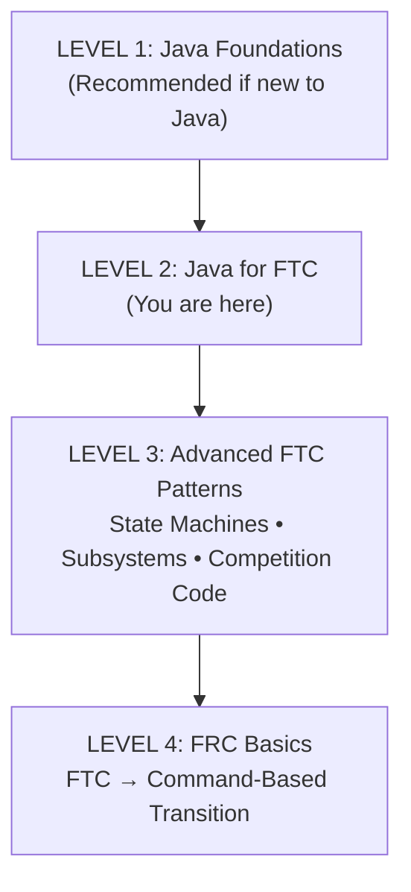
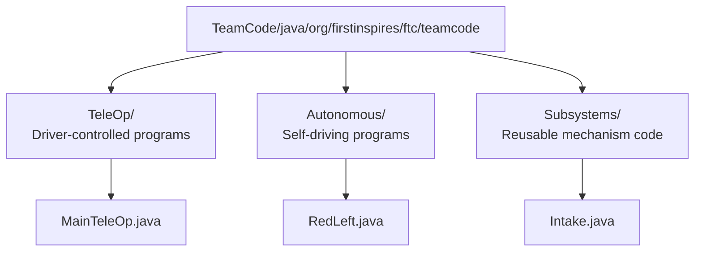

# **Guide to Java \- Level 2: FTC Basics**

## **Who Is This For?**

Middle school FTC students who have completed **Level 1: Java Foundations**. This guide bridges pure Java knowledge into FTC robot programming.  
**Prerequisites:** Java basics (Level 1 or equivalent — a class, self-taught, or prior experience)  
**Time to Complete:** 2-3 weeks alongside robot build

## **Your Learning Path**



**Already know Java?** Skip to Part 2 and start learning FTC-specific patterns.

---

## **Part 1: FTC Project Structure**

### **How FTC Code is Organized**



### **The OpMode: Your Robot's Brain**

Every FTC program is an **OpMode**. There are two types:

| Type | When to Use | How It Works |
| :---- | :---- | :---- |
| `LinearOpMode` | Most programs | Runs top-to-bottom like normal code |
| `OpMode` | Advanced (iterative) | Runs in a loop like a game engine |

**Start with `LinearOpMode`** — it's easier to understand.

??? info "Current FTC (2026)"
    <!-- category: ecosystem convergence -->
    **`LinearOpMode` and the converging ecosystem.** Current FTC programs extend `LinearOpMode` and put everything inside a single `runOpMode()` method. As FTC converges with the WPILib ecosystem, the program structure will shift to separate lifecycle methods — `init()`, `periodic()`, `teleopPeriodic()`, `autonomousPeriodic()` — matching what FRC teams write today. The concepts are identical: setup before the match, a loop during the match, a stop at the end. Only the method names and structure change. When you reach Level 4, this pattern will feel familiar.

---

## **Part 2: LinearOpMode Structure**

### **The Basic Template**

```java
package org.firstinspires.ftc.teamcode;

import com.qualcomm.robotcore.eventloop.opmode.LinearOpMode;
import com.qualcomm.robotcore.eventloop.opmode.TeleOp;
import com.qualcomm.robotcore.hardware.DcMotor;

@TeleOp(name = "My First TeleOp")
public class MyFirstTeleOp extends LinearOpMode {
    
    // Declare hardware here
    private DcMotor leftMotor;
    private DcMotor rightMotor;
    
    @Override
    public void runOpMode() {
        // INIT PHASE: Runs once when you press INIT
        leftMotor = hardwareMap.get(DcMotor.class, "leftMotor");
        rightMotor = hardwareMap.get(DcMotor.class, "rightMotor");
        
        telemetry.addData("Status", "Initialized");
        telemetry.update();
        
        // Wait for driver to press START
        waitForStart();
        
        // RUN PHASE: Runs after START is pressed
        while (opModeIsActive()) {
            // Your teleop code goes here
            // This loop runs over and over until STOP
            
            double drive = -gamepad1.left_stick_y;
            double turn = gamepad1.right_stick_x;
            
            leftMotor.setPower(drive + turn);
            rightMotor.setPower(drive - turn);
            
            telemetry.addData("Drive", drive);
            telemetry.addData("Turn", turn);
            telemetry.update();
        }
    }
}
```

### **Breaking It Down**

**1\. Annotations tell FTC what kind of program this is:**

```java
@TeleOp(name = "My First TeleOp")    // Shows up in TeleOp menu
// OR
@Autonomous(name = "Red Left Auto")  // Shows up in Autonomous menu
```

**2\. Hardware declaration (before runOpMode):**

```java
private DcMotor leftMotor;  // Declare the variable
```

**3\. Hardware initialization (inside runOpMode, before waitForStart):**

```java
leftMotor = hardwareMap.get(DcMotor.class, "leftMotor");
// The string "leftMotor" must match the name in your robot configuration!
```

!!! note "Coach"
    <!-- category: hardware-specific gotcha -->
    **Hardware names are case-sensitive and must be exact.** `"leftMotor"`, `"LeftMotor"`, and `"left_motor"` are three different names to the SDK. Students will stare at perfectly correct code that does nothing because the string in `hardwareMap.get()` doesn't match what was typed into the Driver Hub configuration. Before every practice session with new students, verify the robot config together. As a diagnostic habit, have students add a `telemetry.addData("Status", "Hardware OK")` line immediately after all `hardwareMap.get()` calls — if it appears on screen, initialization succeeded.

**4\. The main loop:**

```java
while (opModeIsActive()) {
    // This runs over and over (about 50 times per second)
    // Put your teleop control code here
}
```

!!! note "Coach"
    <!-- category: common student misconception -->
    **Forgetting `while (opModeIsActive())` is the most common first-session mistake.** Without the loop, the code runs the gamepad line exactly once and then the program ends — the robot does nothing when the student pushes the stick. When this happens, resist the urge to point it out immediately. Let the student add telemetry to see what's executing, then ask: "how many times does this line run?" That question usually gets them to the answer faster than telling them.

---

## **Part 3: Hardware Basics**

### **Motors**

```java
// Declaration
private DcMotor motor;

// Initialization
motor = hardwareMap.get(DcMotor.class, "motorName");

// Basic control
motor.setPower(0.5);   // 50% forward
motor.setPower(-0.5);  // 50% backward
motor.setPower(0);     // Stop

// Direction
motor.setDirection(DcMotor.Direction.REVERSE);  // Flip direction

// Braking behavior
motor.setZeroPowerBehavior(DcMotor.ZeroPowerBehavior.BRAKE);  // Stops quickly
motor.setZeroPowerBehavior(DcMotor.ZeroPowerBehavior.FLOAT);  // Coasts to stop
```

### **Servos**

```java
// Declaration
private Servo servo;

// Initialization
servo = hardwareMap.get(Servo.class, "servoName");

// Control (position 0.0 to 1.0)
servo.setPosition(0.0);   // One extreme
servo.setPosition(0.5);   // Middle
servo.setPosition(1.0);   // Other extreme
```

### **Gamepad Input**

```java
// Joysticks (return -1.0 to 1.0)
double leftY = gamepad1.left_stick_y;    // Up = negative, Down = positive
double leftX = gamepad1.left_stick_x;    // Left = negative, Right = positive
double rightY = gamepad1.right_stick_y;
double rightX = gamepad1.right_stick_x;

// Buttons (return true or false)
boolean aPressed = gamepad1.a;
boolean bPressed = gamepad1.b;
boolean xPressed = gamepad1.x;
boolean yPressed = gamepad1.y;

// Bumpers and triggers
boolean leftBumper = gamepad1.left_bumper;
boolean rightBumper = gamepad1.right_bumper;
float leftTrigger = gamepad1.left_trigger;   // 0.0 to 1.0
float rightTrigger = gamepad1.right_trigger; // 0.0 to 1.0

// D-pad
boolean dpadUp = gamepad1.dpad_up;
boolean dpadDown = gamepad1.dpad_down;
boolean dpadLeft = gamepad1.dpad_left;
boolean dpadRight = gamepad1.dpad_right;
```

!!! note "Coach"
    <!-- category: hardware-specific gotcha -->
    **Joystick Y-axis is inverted — always.** Pushing the stick forward returns a *negative* value. Every student discovers this the first time they push forward and the robot drives backward. Let them hit it. When they do, show them the one-character fix: `double drive = -gamepad1.left_stick_y;`. Negating the input is a permanent habit — it applies to every robot they will ever program.

??? info "Current FTC (2026)"
    <!-- category: ecosystem convergence -->
    **Buttons as booleans vs. Triggers.** In current FTC, `gamepad1.a` returns a plain `boolean`. In FRC and the converging FTC ecosystem, controller inputs are wrapped as `Trigger` objects: `new JoystickButton(controller, 1).onTrue(someCommand)`. The underlying idea is the same — detect a button press, do something — but the API becomes composable and declarative instead of imperative. When you reach Level 4, the boolean checks you learned here will map directly onto Trigger bindings.

### **Telemetry (Driver Station Display)**

```java
// Add data to display
telemetry.addData("Label", value);
telemetry.addData("Motor Power", motor.getPower());
telemetry.addData("Button A", gamepad1.a);

// Must call update() to actually show it!
telemetry.update();
```

!!! note "Coach"
    <!-- category: common student misconception -->
    **`telemetry.update()` must be called to push data to the screen.** `addData()` only queues the data; `update()` sends it. Students who forget this see a blank Driver Station display and assume their sensors are broken. Telemetry is your primary debugging tool for robot code — teach students to instrument everything from the start: motor powers, gamepad values, sensor readings, state flags. A robot you can observe is a robot you can debug.

---

## **Part 4: Common Patterns**

### **Tank Drive**

Each joystick controls one side of the robot:

```java
while (opModeIsActive()) {
    double leftPower = -gamepad1.left_stick_y;
    double rightPower = -gamepad1.right_stick_y;
    
    leftMotor.setPower(leftPower);
    rightMotor.setPower(rightPower);
}
```

### **Arcade Drive**

One joystick controls forward/back and turning:

```java
while (opModeIsActive()) {
    double drive = -gamepad1.left_stick_y;  // Forward/back
    double turn = gamepad1.right_stick_x;   // Turning
    
    leftMotor.setPower(drive + turn);
    rightMotor.setPower(drive - turn);
}
```

### **Button-Controlled Mechanism**

```java
while (opModeIsActive()) {
    if (gamepad1.a) {
        intakeMotor.setPower(1.0);  // Run intake while A held
    } else if (gamepad1.b) {
        intakeMotor.setPower(-1.0); // Reverse while B held
    } else {
        intakeMotor.setPower(0);    // Stop when nothing pressed
    }
}
```

!!! note "Coach"
    <!-- category: common student misconception -->
    **This if/else chain works for 2-3 states. Then it gets painful.** Add a third mode ("hold with gentle reverse power"), a fourth ("slow intake for delicate pieces"), and a need to track the *last* action after you release the button — and the inline if/else becomes unreadable fast. Level 3 solves this with a state machine: an enum field that tracks the current mode, and methods that set it. The pattern you're seeing here is the *problem* that Level 3 addresses. When students write code that feels tangled, remind them Level 3 has the answer.

### **Toggle with Button Press**

```java
boolean clawOpen = false;
boolean lastButtonState = false;

while (opModeIsActive()) {
    boolean currentButtonState = gamepad1.x;
    
    // Detect when button is first pressed (not held)
    if (currentButtonState && !lastButtonState) {
        clawOpen = !clawOpen;  // Toggle the state
    }
    lastButtonState = currentButtonState;
    
    // Set servo based on state
    if (clawOpen) {
        clawServo.setPosition(0.7);
    } else {
        clawServo.setPosition(0.3);
    }
}
```

---

## **Part 5: Basic Autonomous**

### **Time-Based Movement**

```java
@Autonomous(name = "Simple Auto")
public class SimpleAuto extends LinearOpMode {
    
    private DcMotor leftMotor;
    private DcMotor rightMotor;
    
    @Override
    public void runOpMode() {
        leftMotor = hardwareMap.get(DcMotor.class, "leftMotor");
        rightMotor = hardwareMap.get(DcMotor.class, "rightMotor");
        
        waitForStart();
        
        // Drive forward for 2 seconds
        leftMotor.setPower(0.5);
        rightMotor.setPower(0.5);
        sleep(2000);  // Wait 2000 milliseconds (2 seconds)
        
        // Stop
        leftMotor.setPower(0);
        rightMotor.setPower(0);
        
        // Turn right for 1 second
        leftMotor.setPower(0.5);
        rightMotor.setPower(-0.5);
        sleep(1000);
        
        // Stop
        leftMotor.setPower(0);
        rightMotor.setPower(0);
    }
}
```

### **Helper Methods for Cleaner Code**

```java
@Autonomous(name = "Better Auto")
public class BetterAuto extends LinearOpMode {
    
    private DcMotor leftMotor;
    private DcMotor rightMotor;
    
    @Override
    public void runOpMode() {
        leftMotor = hardwareMap.get(DcMotor.class, "leftMotor");
        rightMotor = hardwareMap.get(DcMotor.class, "rightMotor");
        
        waitForStart();
        
        // Now autonomous reads like a story!
        driveForward(0.5, 2000);
        turnRight(0.5, 1000);
        driveForward(0.5, 1500);
        stopMotors();
    }
    
    // Helper methods
    private void driveForward(double power, long milliseconds) {
        leftMotor.setPower(power);
        rightMotor.setPower(power);
        sleep(milliseconds);
    }
    
    private void turnRight(double power, long milliseconds) {
        leftMotor.setPower(power);
        rightMotor.setPower(-power);
        sleep(milliseconds);
    }
    
    private void turnLeft(double power, long milliseconds) {
        leftMotor.setPower(-power);
        rightMotor.setPower(power);
        sleep(milliseconds);
    }
    
    private void stopMotors() {
        leftMotor.setPower(0);
        rightMotor.setPower(0);
    }
}
```

---

## **Part 6: Organizing Your Code**

### **Creating a Subsystem Class**

As your robot gets more complex, organize mechanisms into their own classes:

```java
// Intake.java
package org.firstinspires.ftc.teamcode.Subsystems;

import com.qualcomm.robotcore.hardware.DcMotor;
import com.qualcomm.robotcore.hardware.HardwareMap;

public class Intake {
    private DcMotor intakeMotor;
    
    // Constructor - sets up the hardware
    public Intake(HardwareMap hardwareMap) {
        intakeMotor = hardwareMap.get(DcMotor.class, "intake");
    }
    
    // Methods - what the intake can do
    public void intake() {
        intakeMotor.setPower(1.0);
    }
    
    public void outtake() {
        intakeMotor.setPower(-1.0);
    }
    
    public void stop() {
        intakeMotor.setPower(0);
    }
}
```

### **Using the Subsystem in an OpMode**

```java
@TeleOp(name = "Organized TeleOp")
public class OrganizedTeleOp extends LinearOpMode {
    
    private Intake intake;  // Use your subsystem class
    
    @Override
    public void runOpMode() {
        intake = new Intake(hardwareMap);  // Create the subsystem
        
        waitForStart();
        
        while (opModeIsActive()) {
            // Clean, readable code!
            if (gamepad1.a) {
                intake.intake();
            } else if (gamepad1.b) {
                intake.outtake();
            } else {
                intake.stop();
            }
        }
    }
}
```

---

## **Capstone: `IntakeSubsystem`**

You've learned hardware control, gamepad input, telemetry, and subsystem classes. Now put them together into a realistic mechanism.

**The task:** Build a single-motor intake that tracks what it is currently doing using a state enum. The capstone shows the progression from "inline if/else" to "method on a subsystem class" — the same progression your real competition code will follow.

**Why a state field matters:** Without one, you lose track of what the intake was doing when the driver releases the button. With one, any part of the code can ask `intake.getState()` and get an honest answer.

### **Step 1 — The naive approach (works, but has limits)**

```java
while (opModeIsActive()) {
    if (gamepad1.a) {
        intakeMotor.setPower(1.0);
    } else if (gamepad1.b) {
        intakeMotor.setPower(-0.15);  // gentle hold
    } else {
        intakeMotor.setPower(0);
    }
    telemetry.addData("Power", intakeMotor.getPower());
    telemetry.update();
}
```

This works for two states. Add a third state, a "was I holding?" memory, or a second class that needs to know the intake's status — and it falls apart. That is the exact problem Part 3 solves.

### **Step 2 — `IntakeSubsystem.java`**

```java
package org.firstinspires.ftc.teamcode.Subsystems;

import com.qualcomm.robotcore.hardware.DcMotor;
import com.qualcomm.robotcore.hardware.HardwareMap;
import org.firstinspires.ftc.robotcore.external.Telemetry;

public class IntakeSubsystem {

    // The three modes this intake can be in.
    // An enum keeps states explicit — no more magic numbers or stray booleans.
    public enum IntakeState {
        INTAKING,
        HOLDING,   // slow reverse keeps the game piece from falling out
        STOPPED
    }

    private final DcMotor motor;
    private IntakeState state = IntakeState.STOPPED;

    public IntakeSubsystem(HardwareMap hardwareMap) {
        motor = hardwareMap.get(DcMotor.class, "intake");
        motor.setZeroPowerBehavior(DcMotor.ZeroPowerBehavior.BRAKE);
    }

    // Methods describe robot intent, not hardware action
    public void intake() { state = IntakeState.INTAKING; }
    public void hold()   { state = IntakeState.HOLDING;  }
    public void stop()   { state = IntakeState.STOPPED;  }

    public IntakeState getState() { return state; }

    // Call this once per loop to apply the current state to the hardware
    public void update() {
        switch (state) {
            case INTAKING: motor.setPower(1.0);    break;
            case HOLDING:  motor.setPower(-0.15);  break;
            case STOPPED:
            default:       motor.setPower(0);      break;
        }
    }

    public void addTelemetry(Telemetry telemetry) {
        telemetry.addData("Intake state", state);
        telemetry.addData("Intake power", motor.getPower());
    }
}
```

### **Step 3 — Using it in an OpMode**

```java
@TeleOp(name = "Intake Capstone")
public class IntakeCapstone extends LinearOpMode {

    private IntakeSubsystem intake;

    @Override
    public void runOpMode() {
        intake = new IntakeSubsystem(hardwareMap);

        telemetry.addData("Status", "Initialized");
        telemetry.update();

        waitForStart();

        while (opModeIsActive()) {
            // Driver input sets the desired state
            if (gamepad1.a) {
                intake.intake();
            } else if (gamepad1.b) {
                intake.hold();
            } else if (gamepad1.x) {
                intake.stop();
            }

            // update() applies whatever state was last set — even if no button is pressed now
            intake.update();
            intake.addTelemetry(telemetry);
            telemetry.update();
        }
    }
}
```

### **Try This**

1. Add a fourth state: `SLOW_INTAKE` that runs the motor at 40% power. Bind it to `gamepad1.y`.
2. Add a servo to the subsystem that opens a gate when `INTAKING` and closes it otherwise.
3. Print a warning in telemetry if the motor power is non-zero but `getState()` returns `STOPPED` — that would indicate a bug.

> **Full project:** [`companion/level-2/IntakeSubsystem`](https://github.com/CyberCoyotes/Programmers-Handbook/tree/main/companion/level-2/IntakeSubsystem)

---

## **Check Your Understanding**

Before moving on, you should be able to:

- [ ] Create a new OpMode with the correct annotations  
- [ ] Initialize motors and servos from the hardware map  
- [ ] Read gamepad inputs (joysticks, buttons, triggers)  
- [ ] Control motors based on joystick input  
- [ ] Control servos based on button input  
- [ ] Display information using telemetry  
- [ ] Create a basic time-based autonomous  
- [ ] Create helper methods to organize your code  
- [ ] Create a simple subsystem class

---

## **What's Next?**

The code you've written in this level works. It will also start to break down as your robot gets more complex — more mechanisms, more modes, more buttons. You've already seen a hint of this in the capstone: the inline if/else approach has limits.

Level 3 is the direct answer. Here is how each Level 2 concept maps forward:

| Level 2 concept | Level 3 application |
|---|---|
| `if/else` on button presses | State machine: enum field + `update()` method replaces tangled conditionals |
| Subsystem class with `intake()`, `stop()` | Subsystem with a `state` field — methods set state, `periodic()` applies it |
| Multiple boolean flags tracking status | Single enum that makes illegal states impossible to represent |
| Helper methods in an OpMode | Command-shaped methods on subsystem classes (preview of Level 4) |

**Continue to Level 3: Advanced FTC Patterns** — state machines, subsystem architecture, and the patterns that keep competition code readable under pressure.

When you eventually move to FRC, **Level 4: FRC Basics** will show you how everything you learned here translates directly into the Command-Based framework.

---

## **Quick Reference**

### **OpMode Template**

```java
@TeleOp(name = "Name Here")
public class MyOpMode extends LinearOpMode {
    private DcMotor motor;
    
    @Override
    public void runOpMode() {
        motor = hardwareMap.get(DcMotor.class, "name");
        
        waitForStart();
        
        while (opModeIsActive()) {
            // Your code here
        }
    }
}
```

### **Motor Control**

```java
motor.setPower(0.5);     // 50% forward
motor.setPower(-0.5);    // 50% backward
motor.setPower(0);       // Stop
```

### **Servo Control**

```java
servo.setPosition(0.0);  // One end
servo.setPosition(1.0);  // Other end
```

### **Gamepad**

```java
gamepad1.left_stick_y    // -1 to 1 (inverted!)
gamepad1.right_stick_x   // -1 to 1
gamepad1.a               // true/false
gamepad1.left_trigger    // 0 to 1
```

### **Telemetry**

```java
telemetry.addData("Label", value);
telemetry.update();  // Don't forget this!
```
