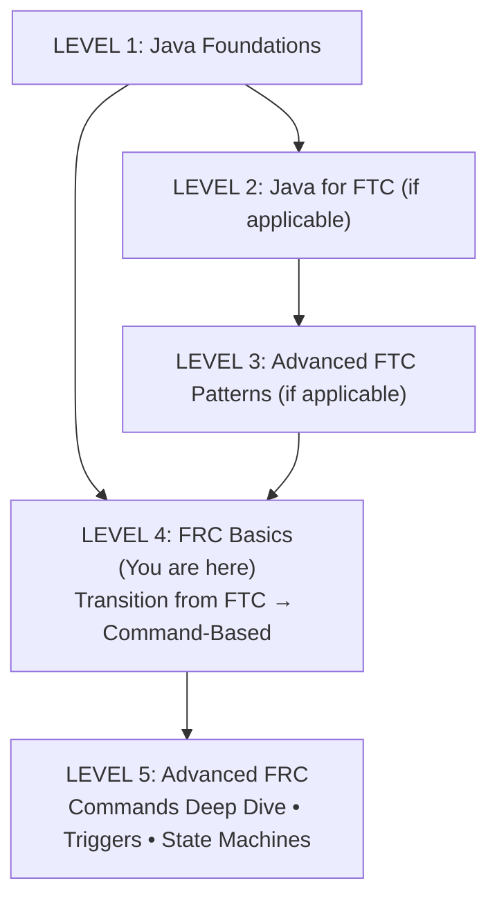

# **Guide to Java \- Level 4: FRC Basics**

## **Who Is This For?**

High school FRC students transitioning from FTC, or students with Java basics who are new to FRC. This guide bridges what you already know into FRC's Command-Based framework.  
**Prerequisites:** Java basics (Level 1\) and ideally FTC experience (Level 2/3)  
**Time to Complete:** 1-2 weeks before build season  
**Reference:** [Glossary](glossary.md)

## **Your Learning Path**



## **The Big Shift: Iterative → Command-Based**

In FTC, you wrote code like this:

```java
// FTC: You check everything in a loop
while (opModeIsActive()) {
    if (gamepad1.a) {
        intake.setPower(1.0);
    } else {
        intake.setPower(0);
    }
}
```

In FRC Command-Based, you **declare relationships once**:

```java
// FRC: Declare it once, framework handles the checking
operator.a().whileTrue(IntakeCommands.run(intake));
```

**That's it.** No loop. The framework checks the button and runs the command for you.

This feels weird at first, but it's powerful:

* No more giant if/else chains  
* No more forgetting to stop a motor  
* Commands automatically handle cleanup  
* Easy to compose complex behaviors

## **FTC → FRC Translation Table**

| FTC Concept | FRC Equivalent | Notes |
| :---- | :---- | :---- |
| `LinearOpMode` | `Robot.java` \+ `RobotContainer.java` | Split into framework and your code |
| `opModeIsActive()` loop | Command Scheduler | Framework runs the loop for you |
| `hardwareMap.get()` | Constructor injection | Motors created in subsystem constructors |
| `gamepad1.a` (boolean) | `controller.a()` (Trigger) | Not `true`/`false` — a `Trigger` is a composable object: chain `.onTrue()`, `.whileTrue()`, `.and()`, `.negate()`, `.debounce()` directly onto it |
| `motor.setPower()` | Same, but inside subsystems | Hardware stays private to subsystem |
| Subsystem class with `update()` | `SubsystemBase` with `periodic()` | Very similar pattern\! |
| State machine enum | Same pattern works\! | Commands can also manage state |
| `sleep()` in auto | `Commands.waitSeconds()` | Non-blocking, composable |
| Time-based auto | Path following (Choreo) | Much more precise |
| — | `addRequirements(subsystem)` | Registers ownership so the scheduler can prevent two commands from fighting over one motor; forgetting this is the subtlest transition bug |
| Multiple objects from one FTC class | One singleton per subsystem | Create once in `RobotContainer`, pass references everywhere; a second `TalonFX` with the same CAN ID corrupts both |
| — | `setDefaultCommand(cmd)` | Runs whenever nothing else is scheduled for that subsystem; always set one so motors never float in an unknown state |

## **Project Structure: Where Things Live**

### **FTC Structure (What You Know)**

```text
TeamCode/
└── org/firstinspires/ftc/teamcode/
    ├── TeleOp/
    ├── Autonomous/
    └── Subsystems/
```

### **FRC Structure (What's New)**

```text
src/main/java/frc/robot/
├── Robot.java              ← Framework entry point (don't touch much)
├── RobotContainer.java     ← YOUR MAIN FILE: create subsystems, bind buttons
├── Constants.java          ← All configuration values
├── subsystems/             ← One file per mechanism
│   ├── Intake.java
│   ├── Shooter.java
│   └── Drivetrain.java
└── commands/               ← Command factory classes
    ├── IntakeCommands.java
    └── DriveCommands.java
```

### **The Key Files**

**RobotContainer.java** — This is like your FTC OpMode, but split differently:

* Creates all subsystems (like your FTC `init` section)  
* Binds buttons to commands (like your FTC `loop`, but declarative)  
* Sets up autonomous routines

**Subsystem files** — Very similar to your FTC subsystem classes:

* Own their hardware (motors, sensors)  
* Provide methods for what they can do  
* Have a `periodic()` method (like your `update()`)

**Constants.java** — All your magic numbers in one place:

* Motor IDs  
* Speeds and limits  
* PID values

## **Subsystems: Almost the Same\!**

If you wrote good FTC subsystems, FRC subsystems will feel familiar:

### **FTC Subsystem (What You Know)**

```java
public class Intake {
    private DcMotor motor;
    
    public Intake(HardwareMap hardwareMap) {
        motor = hardwareMap.get(DcMotor.class, "intake");
    }
    
    public void run() {
        motor.setPower(1.0);
    }
    
    public void stop() {
        motor.setPower(0);
    }
    
    public void update() {
        // Called every loop
    }
}
```

### **FRC Subsystem (What's New)**

```java
public class Intake extends SubsystemBase {
    private final TalonFX motor;
    
    public Intake() {
        motor = new TalonFX(Constants.IntakeConstants.MOTOR_ID);
    }
    
    public void run() {
        motor.set(1.0);
    }
    
    public void stop() {
        motor.set(0);
    }
    
    @Override
    public void periodic() {
        // Called every loop — just like update()!
    }
}
```

**Key differences:**

1. `extends SubsystemBase` — Integrates with Command Scheduler  
2. No `HardwareMap` — Motor IDs come from Constants  
3. `periodic()` instead of `update()` — Called automatically by framework  
4. `TalonFX` instead of `DcMotor` — Different hardware library (CTRE Phoenix 6)

??? info "Current FTC (2026)"
    <!-- category: ecosystem convergence -->
    **Phoenix 6 API vs. Phoenix 5.** The Quick Reference uses `motor.set(speed)`, which is a Phoenix 5 compatibility shim that still works in Phoenix 6. Production code should use Phoenix 6's control request API: `motor.setControl(new DutyCycleOut(speed))`. The control request object is reusable — create it once as a field and call `.withOutput(speed)` each loop. Phoenix Tuner X (the CAN configuration tool) is also different from the Phoenix 5 Tuner — if you're setting CAN IDs or checking firmware, use Tuner X.

!!! note "Coach"
    <!-- category: hardware-specific gotcha -->
    **`hardwareMap` muscle memory is real.** FTC graduates instinctively look for `hardwareMap.get()` when they need hardware. In FRC, motors are constructed directly in the subsystem using a CAN ID integer from `Constants`. The first session on a new robot, have students open `Constants.java` first and verify every CAN ID against Phoenix Tuner X before writing any subsystem code — it prevents 45-minute debugging sessions over a wrong ID. Also: each subsystem is created exactly once in `RobotContainer` and passed wherever it is needed. Creating a second `IntakeSubsystem` instance creates a second `TalonFX` object with the same CAN ID, and both will fight for motor control.

## **Commands: The New Concept**

In FTC, your OpMode directly controlled subsystems:

```java
// FTC: Direct control in loop
if (gamepad1.a) {
    intake.run();
} else {
    intake.stop();
}
```

In FRC, **Commands** are the actions:

```java
// FRC: Command handles the action
Command runIntake = Commands.startEnd(
    () -> intake.run(),    // What to do when starting
    () -> intake.stop(),   // What to do when ending
    intake                 // Which subsystem this uses
);
```

Then you **bind** the command to a button:

```java
// In RobotContainer
operator.a().whileTrue(runIntake);
```

### **Why Commands?**

1. **Automatic cleanup** — `stop()` is called when button released  
2. **No conflicts** — Only one command can use a subsystem at a time  
3. **Composable** — Chain commands together easily  
4. **Reusable** — Same command for teleop and auto

### **Command Factory Pattern**

Instead of creating commands inline, group them in factory classes:

```java
public class IntakeCommands {
    
    private IntakeCommands() {} // Prevent instantiation
    
    public static Command run(Intake intake) {
        return Commands.startEnd(
            () -> intake.run(),
            () -> intake.stop(),
            intake
        );
    }
    
    public static Command reverse(Intake intake) {
        return Commands.startEnd(
            () -> intake.reverse(),
            () -> intake.stop(),
            intake
        );
    }
}
```

Usage:

```java
operator.rightTrigger().whileTrue(IntakeCommands.run(intake));
operator.leftTrigger().whileTrue(IntakeCommands.reverse(intake));
```

!!! note "Coach"
    <!-- category: common student misconception -->
    **Forgetting requirements is the subtlest transition bug.** `Commands.run(() -> intake.run())` looks fine but doesn't tell the scheduler that the intake is in use. `Commands.run(() -> intake.run(), intake)` does. Without the requirement, two commands can both claim the intake simultaneously — one calling `run()` and one calling `stop()` on the same motor, every loop. The behavior is unpredictable and hard to debug. Teach students: the subsystem argument is never optional.

---

## **RobotContainer: Your New Home Base**

This is where everything comes together:

```java
public class RobotContainer {
    
    // ===== SUBSYSTEMS (create one of each) =====
    private final Drivetrain drivetrain = new Drivetrain();
    private final Intake intake = new Intake();
    private final Shooter shooter = new Shooter();
    
    // ===== CONTROLLERS =====
    private final CommandXboxController driver = new CommandXboxController(0);
    private final CommandXboxController operator = new CommandXboxController(1);
    
    // ===== CONSTRUCTOR =====
    public RobotContainer() {
        configureBindings();
        configureDefaultCommands();
    }
    
    private void configureBindings() {
        // ----- DRIVER CONTROLS -----
        // Left Stick: Drive
        // Right Stick: Rotate
        // Left Bumper: Slow mode
        
        driver.leftBumper().whileTrue(
            DriveCommands.slowMode(drivetrain, driver)
        );
        
        // ----- OPERATOR CONTROLS -----
        // Right Trigger: Intake
        // Left Trigger: Reverse intake
        // A: Shoot
        
        operator.rightTrigger().whileTrue(IntakeCommands.run(intake));
        operator.leftTrigger().whileTrue(IntakeCommands.reverse(intake));
        operator.a().onTrue(ShooterCommands.shoot(shooter, intake));
    }
    
    private void configureDefaultCommands() {
        // Drivetrain always runs teleop drive unless something else needs it
        drivetrain.setDefaultCommand(
            DriveCommands.teleopDrive(drivetrain, driver)
        );
    }
    
    public Command getAutonomousCommand() {
        return AutoCommands.simpleAuto(drivetrain, intake, shooter);
    }
}
```

### **Comparing to FTC**

| FTC Location | FRC Location |
| :---- | :---- |
| Hardware init in `runOpMode()` | Subsystem constructors |
| Button checks in `while` loop | `configureBindings()` method |
| Default behavior in `else` | `setDefaultCommand()` |
| Auto selection | `getAutonomousCommand()` |

!!! note "Coach"
    <!-- category: common student misconception -->
    **Do not check controller inputs in `periodic()`.** `periodic()` is called by the scheduler for sensor reads, logging, and state updates. Controller checks belong in `configureBindings()` in `RobotContainer`. Students who come from FTC's `while (opModeIsActive())` loop sometimes move button checks into `periodic()` because it "also runs in a loop" — it does, but there is no controller context there. If you see `controller.getAButton()` inside a subsystem, that is a design smell that needs fixing.

---

## **Button Bindings: Triggers**

In FTC, buttons are booleans:

```java
if (gamepad1.a) { }  // true or false
```

In FRC, buttons are **Triggers** that fire commands:

```java
controller.a()           // Returns a Trigger object
    .onTrue(command)     // Run once when pressed
    .whileTrue(command)  // Run while held
    .onFalse(command)    // Run once when released
```

### **Common Bindings**

| Method | When Command Runs |
| :---- | :---- |
| `.onTrue(cmd)` | Once, when button first pressed |
| `.whileTrue(cmd)` | Continuously while held, stops when released |
| `.onFalse(cmd)` | Once, when button released |
| `.toggleOnTrue(cmd)` | Toggle on/off with each press |

### **Reading Analog Values**

Joysticks and triggers still give analog values:

```java
// In a command or default command
double forward = -driver.getLeftY();   // -1 to 1
double strafe = -driver.getLeftX();    // -1 to 1
double rotate = -driver.getRightX();   // -1 to 1

// Note: Y axis is inverted (forward = negative), so we negate it
```

---

## **Constants: No More Magic Numbers**

In FTC, you might have scattered numbers:

```java
motor.setPower(0.8);  // What is 0.8? Why 0.8?
```

In FRC, everything goes in Constants:

```java
// Constants.java
public final class Constants {
    
    public static final class IntakeConstants {
        public static final int MOTOR_ID = 1;
        public static final double RUN_SPEED = 0.8;
        public static final double REVERSE_SPEED = -0.5;
    }
    
    public static final class ShooterConstants {
        public static final int LEFT_MOTOR_ID = 2;
        public static final int RIGHT_MOTOR_ID = 3;
        public static final double TARGET_RPM = 4500;
    }
}
```

Usage:

```java
import static frc.robot.Constants.IntakeConstants.*;

public class Intake extends SubsystemBase {
    private final TalonFX motor = new TalonFX(MOTOR_ID);
    
    public void run() {
        motor.set(RUN_SPEED);  // Clear what this means!
    }
}
```

---

## **Naming Conventions**

### **Classes (PascalCase)**

```java
public class Intake { }           // Subsystem: noun
public class IntakeCommands { }   // Command factory: noun + Commands
public class RunIntake { }        // Command class: verb + noun
```

### **Methods (camelCase)**

```java
// Actions (verbs)
public void runIntake() { }
public void stopMotor() { }

// Queries (is/has/get)
public boolean hasPiece() { }
public boolean isAtTarget() { }
public double getSpeed() { }
```

### **Variables (camelCase)**

```java
private TalonFX intakeMotor;
private boolean hasPiece;
private double targetSpeed;
```

### **Constants (SCREAMING\_SNAKE\_CASE)**

```java
public static final double MAX_SPEED = 1.0;
public static final int MOTOR_ID = 5;
```

---

## **Your FTC State Machines Still Work\!**

If you learned state machines in Level 3, great news — they work the same way in FRC:

```java
public class Intake extends SubsystemBase {
    
    public enum IntakeState {
        IDLE,
        INTAKING,
        HOLDING,
        FEEDING
    }
    
    private IntakeState currentState = IntakeState.IDLE;
    
    @Override
    public void periodic() {
        switch (currentState) {
            case IDLE:
                motor.set(0);
                break;
            case INTAKING:
                motor.set(INTAKE_SPEED);
                if (hasPiece()) {
                    currentState = IntakeState.HOLDING;
                }
                break;
            // ... etc
        }
    }
    
    public void requestIntake() {
        if (currentState == IntakeState.IDLE) {
            currentState = IntakeState.INTAKING;
        }
    }
}
```

The pattern is identical — `periodic()` instead of `update()`, but same idea.

!!! note "Coach"
    <!-- category: let them fail here -->
    **`sleep()` in a command body stops the entire robot.** `Thread.sleep()` inside `execute()` or `initialize()` blocks the WPILib loop — the drivetrain stops responding, the scheduler stops running, the Driver Station may declare a communication timeout. Let students try it once on a practice robot so they feel the consequence. Then show them `Commands.sequence()` with `Commands.waitSeconds()` as the replacement. The composed version is also easier to read.

---

## **Capstone: Command-Based Intake (CTRE Hardware)**

You've learned subsystems, commands, requirements, default commands, and bindings. Wire them all together into a complete, deployable program.

**The task:** A single-motor intake using a CTRE Talon FX (Kraken X60). A default command keeps it stopped when nothing is scheduled. A button-bound command runs it while the right trigger is held. The scheduler prevents conflicts automatically.

> **Full project:** [`companion/level-4/CommandIntake`](https://github.com/CyberCoyotes/Programmers-Handbook/tree/main/companion/level-4/CommandIntake)

### **`Constants.java`**

```java
package frc.robot;

public final class Constants {

    public static final class IntakeConstants {
        public static final int MOTOR_ID   = 1;      // verify CAN ID in Phoenix Tuner X
        public static final double RUN_SPEED = 0.8;
    }

    public static final class OperatorConstants {
        public static final int CONTROLLER_PORT = 0;
    }
}
```

### **`IntakeSubsystem.java`**

```java
package frc.robot.subsystems;

import com.ctre.phoenix6.controls.DutyCycleOut;
import com.ctre.phoenix6.hardware.TalonFX;
import edu.wpi.first.wpilibj.smartdashboard.SmartDashboard;
import edu.wpi.first.wpilibj2.command.SubsystemBase;

import static frc.robot.Constants.IntakeConstants.*;

public class IntakeSubsystem extends SubsystemBase {

    private final TalonFX motor = new TalonFX(MOTOR_ID);

    // Reuse one control request object — avoids allocating garbage every loop
    private final DutyCycleOut dutyCycle = new DutyCycleOut(0);

    public void run() {
        motor.setControl(dutyCycle.withOutput(RUN_SPEED));
    }

    public void stop() {
        motor.setControl(dutyCycle.withOutput(0));
    }

    @Override
    public void periodic() {
        // Log supply current so you can see stall events during testing
        SmartDashboard.putNumber("Intake/CurrentAmps",
            motor.getSupplyCurrent().getValueAsDouble());
    }
}
```

### **`IntakeCommands.java`**

```java
package frc.robot.commands;

import edu.wpi.first.wpilibj2.command.Command;
import edu.wpi.first.wpilibj2.command.Commands;
import frc.robot.subsystems.IntakeSubsystem;

public final class IntakeCommands {

    private IntakeCommands() {}

    // Runs the intake while active; third arg registers the requirement
    public static Command run(IntakeSubsystem intake) {
        return Commands.startEnd(
            intake::run,
            intake::stop,
            intake
        );
    }

    // Default command — motor stopped, requirement held so nothing else sneaks in
    public static Command idle(IntakeSubsystem intake) {
        return Commands.run(intake::stop, intake);
    }
}
```

### **`RobotContainer.java`**

```java
package frc.robot;

import edu.wpi.first.wpilibj2.command.button.CommandXboxController;
import frc.robot.commands.IntakeCommands;
import frc.robot.subsystems.IntakeSubsystem;

public class RobotContainer {

    // One instance — passed to everything that needs it
    private final IntakeSubsystem intake = new IntakeSubsystem();

    private final CommandXboxController operator =
        new CommandXboxController(Constants.OperatorConstants.CONTROLLER_PORT);

    public RobotContainer() {
        // Default command: motor stopped whenever nothing else is scheduled
        intake.setDefaultCommand(IntakeCommands.idle(intake));
        configureBindings();
    }

    private void configureBindings() {
        // Right trigger held → run; release → command ends → stop() called automatically
        operator.rightTrigger().whileTrue(IntakeCommands.run(intake));
    }
}
```

### **Try This**

1. Add `IntakeCommands.reverse(intake)` (negative output) and bind it to `operator.leftTrigger()`.
2. Watch the `Intake/CurrentAmps` value on SmartDashboard while running the intake. Stall the roller by hand — the current will spike. This is how you detect game-piece grabs without a sensor.
3. Add a second subsystem (e.g., a `LEDSubsystem` using `AddressableLED`) and schedule a command that sets the LEDs green whenever the intake is running.

---

## **Quick Comparison: Full Example**

### **FTC TeleOp**

```java
@TeleOp(name = "Main TeleOp")
public class MainTeleOp extends LinearOpMode {
    private Intake intake;
    private Arm arm;
    
    @Override
    public void runOpMode() {
        intake = new Intake(hardwareMap);
        arm = new Arm(hardwareMap);
        
        waitForStart();
        
        while (opModeIsActive()) {
            // Intake control
            if (gamepad1.a) {
                intake.run();
            } else if (gamepad1.b) {
                intake.reverse();
            } else {
                intake.stop();
            }
            
            // Arm control
            if (gamepad1.dpad_up) {
                arm.goToPosition(Arm.Position.HIGH);
            }
            if (gamepad1.dpad_down) {
                arm.goToPosition(Arm.Position.LOW);
            }
            
            intake.update();
            arm.update();
            
            telemetry.addData("Intake", intake.getState());
            telemetry.update();
        }
    }
}
```

### **FRC Equivalent**

```java
// RobotContainer.java
public class RobotContainer {
    private final Intake intake = new Intake();
    private final Arm arm = new Arm();
    private final CommandXboxController operator = new CommandXboxController(0);
    
    public RobotContainer() {
        configureBindings();
    }
    
    private void configureBindings() {
        // Intake control
        operator.a().whileTrue(IntakeCommands.run(intake));
        operator.b().whileTrue(IntakeCommands.reverse(intake));
        // No "else" needed — commands handle cleanup!
        
        // Arm control
        operator.povUp().onTrue(ArmCommands.goToPosition(arm, Arm.Position.HIGH));
        operator.povDown().onTrue(ArmCommands.goToPosition(arm, Arm.Position.LOW));
    }
}

// IntakeCommands.java
public class IntakeCommands {
    public static Command run(Intake intake) {
        return Commands.startEnd(
            () -> intake.run(),
            () -> intake.stop(),
            intake
        );
    }
    
    public static Command reverse(Intake intake) {
        return Commands.startEnd(
            () -> intake.reverse(),
            () -> intake.stop(),
            intake
        );
    }
}
```

Notice how the FRC version:

* No `while` loop — framework handles it  
* No `else` for stopping — `startEnd` handles cleanup  
* No manual `update()` calls — `periodic()` runs automatically  
* Declarations are separate from logic

---

## **What's Next?**

The commands in this level each do one thing. Level 5 answers the question you'll almost immediately ask: **how do I make things happen in a sequence?**

| Level 4 concept | Level 5 application |
|---|---|
| `Commands.startEnd(start, stop, subsystem)` — one action | `Commands.sequence(cmd1, cmd2, cmd3)` runs commands one after another; `Commands.parallel(cmd1, cmd2)` runs them at the same time |
| One command per button binding | Complex `Trigger` conditions: `.and()`, `.or()`, `.negate()`, `.debounce()`, and custom triggers built from sensor values |
| State field managed in a subsystem | State machine coordinated through command scheduling: the subsystem's enum drives which commands are valid to run |
| No autonomous | Choreo trajectories as named commands, composed with scoring and intake commands into a full auto routine |

**Continue to Level 5: Advanced FRC Patterns** — command compositions, autonomous sequences, and the multi-mechanism elevator that demonstrates everything together.

---

## **Quick Reference**

### **Subsystem Template**

```java
public class MySubsystem extends SubsystemBase {
    private final TalonFX motor;
    
    public MySubsystem() {
        motor = new TalonFX(Constants.MyConstants.MOTOR_ID);
    }
    
    public void doSomething() {
        motor.set(Constants.MyConstants.SPEED);
    }
    
    public void stop() {
        motor.set(0);
    }
    
    @Override
    public void periodic() {
        // Logging, state updates
    }
}
```

### **Command Factory Template**

```java
public class MyCommands {
    private MyCommands() {}
    
    public static Command doSomething(MySubsystem subsystem) {
        return Commands.startEnd(
            () -> subsystem.doSomething(),
            () -> subsystem.stop(),
            subsystem
        );
    }
}
```

### **RobotContainer Template**

```java
public class RobotContainer {
    private final MySubsystem subsystem = new MySubsystem();
    private final CommandXboxController controller = new CommandXboxController(0);
    
    public RobotContainer() {
        configureBindings();
    }
    
    private void configureBindings() {
        controller.a().whileTrue(MyCommands.doSomething(subsystem));
    }
}
```

### **Common Button Bindings**

```java
controller.a().onTrue(cmd);       // Once on press
controller.a().whileTrue(cmd);    // While held
controller.a().onFalse(cmd);      // Once on release
controller.a().toggleOnTrue(cmd); // Toggle
```
