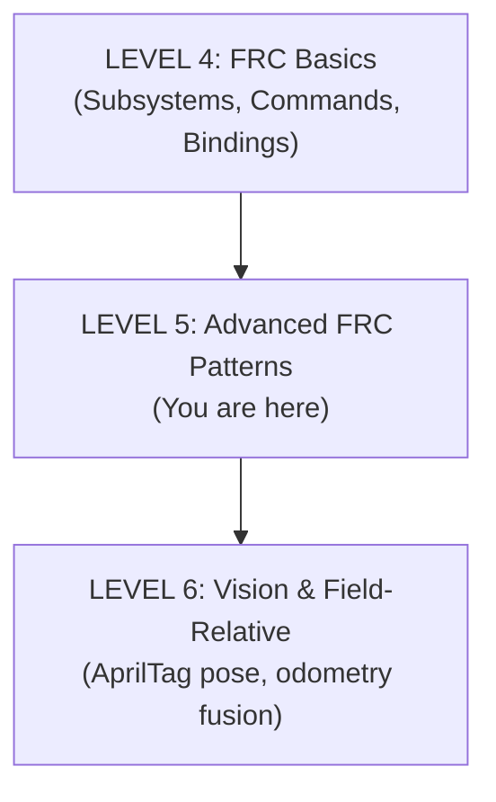

# **Guide to Java \- Level 5: Advanced FRC Patterns**

## **Who Is This For?**

FRC students who understand the basics of Command-Based and want to level up. This guide covers command compositions, advanced triggers, state machines, and patterns used by competitive teams.

**Prerequisites:** Level 4: FRC Basics (comfortable with subsystems, basic commands, button bindings)

**Time to Complete:** Ongoing reference throughout the season

## **Your Learning Path**



## **Part 1: Command Compositions**

Simple commands are building blocks. Compositions combine them into complex behaviors.

### **Sequential: One After Another**

```java
Command scoreSequence = Commands.sequence(
    ArmCommands.goToPosition(arm, Position.SCORE),
    Commands.waitUntil(() -> arm.isAtTarget()),
    IntakeCommands.feed(intake),
    Commands.waitSeconds(0.3),
    ArmCommands.goToPosition(arm, Position.STOW)
);
```

Each step completes before the next begins.

### **Parallel: All At Once**

```java
// Ends when ALL commands finish
Command prepareToScore = Commands.parallel(
    ShooterCommands.spinUp(shooter),
    ArmCommands.goToPosition(arm, Position.SCORE),
    DriveCommands.alignToTarget(drivetrain)
);
```

### **Race: First One Wins**

```java
// Ends when FIRST command finishes — great for timeouts!
Command intakeWithTimeout = Commands.race(
    IntakeCommands.run(intake).until(() -> intake.hasPiece()),
    Commands.waitSeconds(3.0)  // Give up after 3 seconds
);
```

### **Deadline: One Sets the Pace**

```java
// Run other commands, but only until the deadline finishes
Command timedPrep = Commands.deadline(
    Commands.waitSeconds(2.0),        // The deadline
    ShooterCommands.spinUp(shooter),  // These run until deadline
    ArmCommands.aim(arm)
);
```

### **Composition Quick Reference**

| Method | Ends When | Use For |
| :---- | :---- | :---- |
| `sequence(a, b, c)` | Last finishes | Step-by-step actions |
| `parallel(a, b, c)` | ALL finish | Simultaneous prep |
| `race(a, b, c)` | FIRST finishes | Timeouts |
| `deadline(main, others)` | Main finishes | Timed groups |

## **Command Modifiers**

Modify any command's behavior:

### **.until() — Stop on Condition**

```java
IntakeCommands.run(intake)
    .until(() -> intake.hasPiece());
```

### **.withTimeout() — Time Limit**

```java
IntakeCommands.run(intake)
    .withTimeout(3.0);
```

### **.unless() — Skip If True**

```java
IntakeCommands.run(intake)
    .unless(() -> intake.hasPiece());  // Skip if already have piece
```

### **.onlyIf() — Only Run If True**

```java
ShooterCommands.shoot(shooter)
    .onlyIf(() -> shooter.isAtSpeed());  // Only if ready
```

### **.andThen() — Chain Commands**

```java
IntakeCommands.run(intake)
    .until(() -> intake.hasPiece())
    .andThen(Commands.runOnce(() -> leds.setGreen()));
```

### **.alongWith() — Run Together**

```java
IntakeCommands.run(intake)
    .alongWith(Commands.runOnce(() -> leds.setPurple()));
```

### **.finallyDo() — Always Cleanup**

```java
Commands.run(() -> motor.set(1.0), subsystem)
    .finallyDo(() -> motor.set(0));  // Runs even if interrupted
```

## **Part 2: Advanced Triggers**

### **Controller Button Reference**

`CommandXboxController` gives you triggers for every button:

```java
// Face buttons
controller.a()
controller.b()
controller.x()
controller.y()

// Bumpers
controller.leftBumper()
controller.rightBumper()

// Triggers (analog, but can be used as buttons)
controller.leftTrigger()           // Default threshold (0.5)
controller.leftTrigger(0.3)        // Custom threshold
controller.rightTrigger()
controller.rightTrigger(0.3)

// Stick buttons (pressing the stick down)
controller.leftStick()
controller.rightStick()

// Center buttons
controller.start()
controller.back()

// D-pad
controller.pov(0)      // Up
controller.pov(90)     // Right
controller.pov(180)    // Down
controller.pov(270)    // Left
controller.povUp()     // Convenience method
controller.povDown()
controller.povLeft()
controller.povRight()
```

### **Reading Analog Values**

Joysticks and triggers give analog values:

```java
// In a command or default command:
double forward = -driver.getLeftY();    // Forward/backward
double strafe = -driver.getLeftX();     // Left/right strafe
double rotation = -driver.getRightX();  // Rotation

// Note: Y axes are inverted (pushing forward gives negative value)
// That's why we negate them

// Triggers give 0.0 to 1.0
double throttle = driver.getRightTriggerAxis();
```

### **Deadzones**

Controllers have drift near the center. Apply deadzones:

```java
private double applyDeadzone(double value, double deadzone) {
    if (Math.abs(value) < deadzone) {
        return 0.0;
    }
    // Scale remaining range to 0-1
    return Math.signum(value) * (Math.abs(value) - deadzone) / (1.0 - deadzone);
}

// Usage
double forward = applyDeadzone(-driver.getLeftY(), 0.1);
```

Or use WPILib's MathUtil:

```java
import edu.wpi.first.math.MathUtil;

double forward = MathUtil.applyDeadband(-driver.getLeftY(), 0.1);
```

### **Custom Triggers from Sensors**

Any boolean can be a trigger:

```java
// Sensor-based triggers
Trigger hasPiece = new Trigger(() -> intake.hasPiece());
Trigger targetVisible = new Trigger(() -> limelight.hasTarget());
Trigger armReady = new Trigger(() -> arm.isAtTarget());

// Bind commands to sensor events
hasPiece.onTrue(Commands.runOnce(() -> leds.setGreen()));
hasPiece.onFalse(Commands.runOnce(() -> leds.setOff()));
```

### **Combining Triggers**

```java
// AND — both must be true
Trigger readyToShoot = shooter.atSpeed()
    .and(() -> arm.isAtTarget())
    .and(() -> intake.hasPiece());

// OR — either true
Trigger needsAttention = intake.isJammed()
    .or(() -> shooter.overheating());

// NOT — inverted
Trigger noPiece = hasPiece.negate();
```

### **Complex Button Patterns**

```java
// Modifier buttons
Trigger xWithModifier = operator.x().and(operator.leftBumper());
Trigger xAlone = operator.x().and(operator.leftBumper().negate());

xAlone.onTrue(ArmCommands.goToPreset1(arm));
xWithModifier.onTrue(ArmCommands.goToPreset2(arm));
```

```java
// Hold to charge, release to fire
operator.a().whileTrue(ShooterCommands.spinUp(shooter));
operator.a().onFalse(
    ShooterCommands.feed(intake)
        .onlyIf(() -> shooter.isAtSpeed())
);
```

### **Debouncing**

```java
// Require button held for 1 second (prevents accidental triggers)
driver.y()
    .debounce(1.0)
    .onTrue(Commands.runOnce(() -> drivetrain.resetGyro()));
```

### **Pattern: Confirm Before Action**

```java
// Hold Y for 1 second to reset gyro (prevents accidental resets)
driver.y()
    .and(() -> driver.y().getAsBoolean())  // Still holding
    .debounce(1.0)                          // For 1 second
    .onTrue(Commands.runOnce(() -> drivetrain.resetGyro()));
```

### **Pattern: Different Actions for Tap vs Hold**

```java
// Tap A = quick action, Hold A = different action
driver.a().onTrue(
    Commands.either(
        IntakeCommands.quickPulse(intake),    // If tap
        IntakeCommands.run(intake),           // If hold
        () -> driver.a().getAsBoolean()       // Check if still held
    ).withTimeout(0.15)  // Decision window
);
```

### **Tips for Button Mapping**

**Driver vs Operator Split**

Typical division of responsibilities:

**Driver (controller 0):**

- Drivetrain control (joysticks)  
- Slow mode  
- Auto-align / vision assist  
- Maybe: intake (if one-person drive team)

**Operator (controller 1):**

- All mechanism control  
- Scoring positions  
- Climb controls  
- Manual overrides

**Use Muscle Memory**

- **Triggers** for continuous actions (intake, outtake)  
- **Face buttons** for discrete actions (shoot, preset positions)  
- **Bumpers** for modifiers or secondary controls  
- **D-pad** for preset positions

**Document Your Bindings\!**

```java
private void configureBindings() {
    // ==================== DRIVER CONTROLS ====================
    // Left Stick:  Drive forward/back, strafe left/right
    // Right Stick: Rotation
    // Left Bumper: Slow mode (hold)
    // Right Bumper: Auto-align to target (hold)
    // Back: Reset gyro
    
    // ==================== OPERATOR CONTROLS ====================
    // Right Trigger: Intake (hold)
    // Left Trigger:  Reverse intake (hold)
    // A: Shoot
    // B: Stow position
    // X: Amp position
    // Y: Speaker position
    // D-pad Up: Arm up manual
    // D-pad Down: Arm down manual
    
    // ... bindings ...
}
```

## **Part 3: State Machines in FRC**

### **When Do You Need a State Machine?**

**Start Simple: Booleans and Helper Methods**

For basic subsystems, simple is better:

```java
public class Intake extends SubsystemBase {
    private final TalonFX motor;
    private final DigitalInput beamBreak;
    
    public void run() { motor.set(0.8); }
    public void stop() { motor.set(0); }
    public void reverse() { motor.set(-0.5); }
    
    public boolean hasPiece() { return beamBreak.get(); }
}
```

**This is fine\!** Don't add complexity you don't need.

### **Warning Signs You Might Need a State Machine**

Watch for these patterns in your code:

**1\. Multiple booleans tracking status:**

```java
// Getting messy...
private boolean isIntaking = false;
private boolean isHolding = false;
private boolean isFeeding = false;
private boolean isEjecting = false;
```

**2\. Booleans that can conflict:**

```java
// Wait, can these both be true? What happens?
if (isIntaking && isHolding) { /* ??? */ }
```

**3\. Complex helper methods checking multiple flags:**

```java
public boolean isReady() {
    return hasPiece && !isFeeding && !isEjecting && isHolding;
}
```

**4\. Transition logic scattered everywhere:**

```java
// In one command...
if (hasPiece()) {
    isIntaking = false;
    isHolding = true;
}

// In another command...
if (!hasPiece()) {
    isHolding = false;
}
```

When you see these patterns, a state machine makes the code **clearer**, not more complex.

### **When to Use State Machines vs Commands**

| Situation | Use |
| :---- | :---- |
| Simple action (run motor while button held) | Command |
| Sequence of actions | Command composition |
| Complex subsystem with multiple sensors | State machine in subsystem |
| Behavior depends on previous state | State machine |
| Multiple interacting conditions | State machine |

### **When NOT to Use State Machines**

**Keep it simple when:**

**Single-purpose mechanisms:**

```java
// Climber that just goes up or down - no state machine needed
public class Climber extends SubsystemBase {
    public void extend() { motor.set(1.0); }
    public void retract() { motor.set(-1.0); }
    public void stop() { motor.set(0); }
}
```

**Mechanisms where commands handle all logic:**

```java
// Commands already sequence everything
Commands.sequence(
    Commands.runOnce(() -> intake.run()),
    Commands.waitUntil(() -> intake.hasPiece()),
    Commands.runOnce(() -> intake.stop())
);
```

**Simple boolean state:**

```java
// Just need to know one thing
public boolean hasPiece() { return beamBreak.get(); }
```

!!! note "Coach"
    <!-- category: common student misconception -->
    **Students over-apply state machines coming out of Level 3.** If a command runs a motor for 0.5 s and stops, that is a command — not a state machine. Reserve state machines for mechanisms that have persistent mode: an elevator that needs to know which position it is currently targeting, an intake that distinguishes INTAKING from HOLDING. If the state changes only in response to commands and never from sensors, a command is sufficient. The cost of an unnecessary state machine is a periodic() method that fights the scheduler.

### **State Machine in a Subsystem**

```java
public class Intake extends SubsystemBase {
    
    public enum IntakeState {
        IDLE,
        INTAKING,
        HOLDING,
        FEEDING,
        EJECTING
    }
    
    private IntakeState currentState = IntakeState.IDLE;
    private final TalonFX motor;
    private final DigitalInput beamBreak;
    
    public Intake() {
        motor = new TalonFX(MOTOR_ID);
        beamBreak = new DigitalInput(BEAM_BREAK_PORT);
    }
    
    @Override
    public void periodic() {
        switch (currentState) {
            case IDLE:
                motor.set(0);
                break;
                
            case INTAKING:
                motor.set(INTAKE_SPEED);
                if (hasPiece()) {
                    setState(IntakeState.HOLDING);
                }
                break;
                
            case HOLDING:
                motor.set(HOLD_SPEED);
                if (!hasPiece()) {
                    setState(IntakeState.IDLE);
                }
                break;
                
            case FEEDING:
                motor.set(FEED_SPEED);
                if (!hasPiece()) {
                    setState(IntakeState.IDLE);
                }
                break;
                
            case EJECTING:
                motor.set(EJECT_SPEED);
                break;
        }
        
        // Logging
        SmartDashboard.putString("Intake/State", currentState.toString());
    }
    
    private void setState(IntakeState newState) {
        if (newState != currentState) {
            System.out.println("Intake: " + currentState + " → " + newState);
            currentState = newState;
        }
    }
    
    // Request methods with guards
    public void requestIntake() {
        if (currentState == IntakeState.IDLE) {
            setState(IntakeState.INTAKING);
        }
    }
    
    public void requestFeed() {
        if (currentState == IntakeState.HOLDING) {
            setState(IntakeState.FEEDING);
        }
    }
    
    public void requestEject() {
        setState(IntakeState.EJECTING);
    }
    
    public void requestIdle() {
        setState(IntakeState.IDLE);
    }
    
    // Queries
    public IntakeState getState() { return currentState; }
    public boolean hasPiece() { return !beamBreak.get(); }
    public boolean isHolding() { return currentState == IntakeState.HOLDING; }
}
```

### **Commands for State Machine Subsystems**

```java
public class IntakeCommands {
    
    public static Command intake(Intake intake) {
        return Commands.startEnd(
            () -> intake.requestIntake(),
            () -> intake.requestIdle(),
            intake
        ).until(() -> intake.isHolding());
    }
    
    public static Command feed(Intake intake) {
        return Commands.runOnce(() -> intake.requestFeed(), intake);
    }
    
    public static Command eject(Intake intake) {
        return Commands.startEnd(
            () -> intake.requestEject(),
            () -> intake.requestIdle(),
            intake
        );
    }
}
```

### **Advanced Pattern: Desired vs Current State**

For mechanisms that take time to reach their target (like arms), separate what you *want* from what *is*:

```java
public class Arm extends SubsystemBase {
    
    public enum ArmState {
        STOW,
        INTAKE,
        AMP,
        SPEAKER_CLOSE,
        SPEAKER_FAR
    }
    
    private ArmState currentState = ArmState.STOW;
    private ArmState desiredState = ArmState.STOW;
    
    public void requestState(ArmState state) {
        desiredState = state;
    }
    
    @Override
    public void periodic() {
        // Move toward desired state
        double targetAngle = getTargetAngle(desiredState);
        armMotor.setPosition(targetAngle);
        
        // Update current state when we arrive
        if (isAtTarget()) {
            currentState = desiredState;
        }
        
        // Log both states
        SmartDashboard.putString("Arm/Desired", desiredState.toString());
        SmartDashboard.putString("Arm/Current", currentState.toString());
    }
    
    private double getTargetAngle(ArmState state) {
        switch (state) {
            case STOW: return 0.0;
            case INTAKE: return 15.0;
            case AMP: return 90.0;
            case SPEAKER_CLOSE: return 45.0;
            case SPEAKER_FAR: return 35.0;
            default: return 0.0;
        }
    }
    
    public boolean isAtTarget() {
        return Math.abs(armMotor.getPosition() - getTargetAngle(desiredState)) < 2.0;
    }
    
    public boolean atState(ArmState state) {
        return currentState == state && desiredState == state;
    }
}
```

### **State Diagram: Visualize Before Coding**

Drawing a state diagram helps design your state machine:

```
                    ┌───────────────────────┐
                    │                       │
                    ▼                       │
              ┌──────────┐                  │
     ┌───────►│   IDLE   │◄────────────┐    │
     │        └────┬─────┘             │    │
     │             │                   │    │
     │             │ requestIntake()   │    │
     │             ▼                   │    │
     │        ┌──────────┐             │    │
     │        │ INTAKING │─────────────┤    │
     │        └────┬─────┘  piece lost │    │
     │             │                   │    │
     │             │ piece detected    │    │
     │             ▼                   │    │
     │        ┌──────────┐             │    │
     │        │ HOLDING  │─────────────┘    │
     │        └────┬─────┘  piece lost      │
     │             │                        │
     │             │ requestFeed()          │
     │             ▼                        │
     │        ┌──────────┐                  │
     │        │ FEEDING  │──────────────────┘
     │        └──────────┘  piece fed
     │
     │        ┌──────────┐
     └────────│ EJECTING │
              └──────────┘
              (from any state via requestEject())
```

**Draw this BEFORE you write code.** It makes everything clearer.

## **Part 4: Lambdas and Method References**

### **Lambda Refresher**

Lambdas are compact ways to define behavior:

```java
// Full anonymous class (verbose)
Runnable r = new Runnable() {
    @Override
    public void run() {
        intake.stop();
    }
};

// Lambda (compact)
Runnable r = () -> intake.stop();

// With parameters
DoubleSupplier speed = () -> controller.getLeftY();
BooleanSupplier hasPiece = () -> intake.hasPiece();
```

### **Method References**

When a lambda just calls one method, use a method reference:

```java
// Lambda
() -> intake.stop()

// Method reference (same thing, cleaner)
intake::stop

// Examples
Commands.runOnce(intake::stop, intake);
new Trigger(intake::hasPiece);
Commands.waitUntil(shooter::isAtSpeed);
```

### **When You Can Use Method References**

```java
// ✅ Works — no parameters, matching signature
Runnable r = intake::stop;
BooleanSupplier b = intake::hasPiece;

// ❌ Doesn't work — lambda needs parameters
// intake::setSpeed  // setSpeed needs a double!

// ✅ Use lambda when you need to pass values
() -> intake.setSpeed(0.5)
```

## **Part 5: Enums with Data**

Enums can carry configuration data:

### **Basic Enum with Values**

```java
public enum ArmPosition {
    STOW(0),
    INTAKE(15),
    AMP(90),
    SPEAKER_CLOSE(45),
    SPEAKER_FAR(35);
    
    public final double angleDegrees;
    
    ArmPosition(double angleDegrees) {
        this.angleDegrees = angleDegrees;
    }
}

// Usage
arm.goToAngle(ArmPosition.SPEAKER_CLOSE.angleDegrees);
```

### **Enum with Multiple Values**

```java
public enum ShooterPreset {
    SUBWOOFER(2000, 45.0),
    PODIUM(3500, 55.0),
    AMP(1000, 90.0),
    PASS(2500, 30.0);
    
    public final double rpm;
    public final double angleDegrees;
    
    ShooterPreset(double rpm, double angleDegrees) {
        // "this.rpm" = the field, "rpm" = the parameter
        this.rpm = rpm;
        this.angleDegrees = angleDegrees;
    }
}

// Usage
ShooterPreset preset = ShooterPreset.PODIUM;
shooter.setTargetRPM(preset.rpm);
arm.setAngle(preset.angleDegrees);
```

### **Using Enums in Commands**

```java
public static Command aimAndShoot(
        Shooter shooter, 
        Arm arm, 
        Intake intake,
        ShooterPreset preset) {
    
    return Commands.sequence(
        Commands.parallel(
            Commands.runOnce(() -> shooter.setTargetRPM(preset.rpm)),
            Commands.runOnce(() -> arm.setAngle(preset.angleDegrees))
        ),
        Commands.waitUntil(() -> shooter.atSpeed() && arm.atTarget()),
        IntakeCommands.feed(intake)
    );
}

// Bindings
operator.a().onTrue(aimAndShoot(shooter, arm, intake, ShooterPreset.SPEAKER_CLOSE));
operator.b().onTrue(aimAndShoot(shooter, arm, intake, ShooterPreset.AMP));
```

## **Part 6: Autonomous Patterns**

### **Basic Auto with Commands**

```java
public static Command simpleAuto(Drivetrain drivetrain, Intake intake, Shooter shooter) {
    return Commands.sequence(
        // Shoot preload
        ShooterCommands.shoot(shooter, intake),
        
        // Drive forward
        DriveCommands.driveDistance(drivetrain, 2.0),  // meters
        
        // Intake
        IntakeCommands.run(intake)
            .until(() -> intake.hasPiece())
            .withTimeout(3.0),
        
        // Drive back
        DriveCommands.driveDistance(drivetrain, -2.0),
        
        // Shoot again
        ShooterCommands.shoot(shooter, intake)
    );
}
```

### **Parallel Actions in Auto**

```java
public static Command efficientAuto(Drivetrain drivetrain, Intake intake, Shooter shooter) {
    return Commands.sequence(
        // Shoot preload
        ShooterCommands.shoot(shooter, intake),
        
        // Drive to piece WHILE running intake
        Commands.deadline(
            DriveCommands.followPath(drivetrain, "ToFirstPiece"),
            IntakeCommands.run(intake)
        ),
        
        // Spin up shooter WHILE driving back
        Commands.deadline(
            DriveCommands.followPath(drivetrain, "ToShootingPosition"),
            ShooterCommands.spinUp(shooter)
        ),
        
        // Shoot (already spun up!)
        IntakeCommands.feed(intake)
    );
}
```

### **Conditional Auto**

```java
public static Command adaptiveAuto(Drivetrain drivetrain, Intake intake, Shooter shooter) {
    return Commands.sequence(
        // Try to get first piece
        Commands.deadline(
            DriveCommands.followPath(drivetrain, "ToFirstPiece"),
            IntakeCommands.run(intake)
        ),
        
        // Check if we got it
        Commands.either(
            // If we got piece: go score
            Commands.sequence(
                DriveCommands.followPath(drivetrain, "ToScore"),
                ShooterCommands.shoot(shooter, intake)
            ),
            // If no piece: try second location
            Commands.sequence(
                DriveCommands.followPath(drivetrain, "ToSecondPiece"),
                IntakeCommands.run(intake).withTimeout(2.0)
            ),
            () -> intake.hasPiece()  // Condition to check
        )
    );
}
```

### **Auto Selector**

```java
// In RobotContainer
private final SendableChooser<Command> autoChooser = new SendableChooser<>();

public RobotContainer() {
    // Add auto options
    autoChooser.setDefaultOption("Simple Auto", 
        AutoCommands.simpleAuto(drivetrain, intake, shooter));
    autoChooser.addOption("Two Piece", 
        AutoCommands.twoPieceAuto(drivetrain, intake, shooter));
    autoChooser.addOption("Three Piece", 
        AutoCommands.threePieceAuto(drivetrain, intake, shooter));
    autoChooser.addOption("Do Nothing", 
        Commands.none());
    
    SmartDashboard.putData("Auto Chooser", autoChooser);
}

public Command getAutonomousCommand() {
    return autoChooser.getSelected();
}
```

!!! note "Coach"
    <!-- category: real-robot demo opportunity -->
    **Walk through a full auto routine on the whiteboard before writing a line of code.** List every action in order, then identify which ones can run in parallel ("elevator raises while driving"). Students who plan in English first make far fewer composition mistakes. After the whiteboard session, the code nearly writes itself — each bullet becomes a command, each "while" becomes `Commands.parallel` or `Commands.deadline`.

## **Part 7: Motion Profiling and Feedforward**

Open-loop power commands (just `motor.set(0.5)`) work for simple mechanisms. For an elevator, they don't — gravity pulls it down at different rates depending on position, and slamming to a target at full speed damages hardware. Motion profiling shapes the velocity over time; feedforward estimates the voltage needed to follow that profile.

### **Why You Need Both**

| Problem | What fixes it |
|---|---|
| Elevator overshoots the target | TrapezoidProfile (limits velocity and acceleration) |
| Elevator drifts down under gravity | ElevatorFeedforward (kG term adds voltage to oppose gravity) |
| Elevator is slow to respond | ElevatorFeedforward (kV term adds voltage proportional to desired velocity) |

### **Elevator Positions as an Enum**

```java
public enum ElevatorPosition {
    STOWED(0.00),   // fully retracted
    INTAKE(0.20),   // at game-piece pickup height
    L1    (0.40),
    L2    (0.65),
    L3    (0.90),
    L4    (1.20);   // meters from zero

    public final double heightMeters;
    ElevatorPosition(double h) { heightMeters = h; }
}
```

### **Profiled Elevator Subsystem**

```java
import com.ctre.phoenix6.controls.PositionVoltage;
import com.ctre.phoenix6.hardware.TalonFX;
import edu.wpi.first.math.controller.ElevatorFeedforward;
import edu.wpi.first.math.trajectory.TrapezoidProfile;
import edu.wpi.first.wpilibj2.command.SubsystemBase;

import static frc.robot.Constants.ElevatorConstants.*;

public class ElevatorSubsystem extends SubsystemBase {

    private final TalonFX motor = new TalonFX(MOTOR_ID);

    // kS: static friction (V), kG: gravity compensation (V),
    // kV: velocity gain (V·s/m), kA: acceleration gain (V·s²/m)
    private final ElevatorFeedforward feedforward =
        new ElevatorFeedforward(kS, kG, kV, kA);

    private final TrapezoidProfile.Constraints constraints =
        new TrapezoidProfile.Constraints(MAX_VEL_MPS, MAX_ACCEL_MPS2);

    // Current profiled setpoint and goal
    private TrapezoidProfile.State setpoint = new TrapezoidProfile.State();
    private TrapezoidProfile.State goal     = new TrapezoidProfile.State();

    public void goTo(ElevatorPosition position) {
        goal = new TrapezoidProfile.State(position.heightMeters, 0);
    }

    public boolean isAtTarget() {
        double error = Math.abs(getHeightMeters() - goal.position);
        return error < TOLERANCE_METERS;
    }

    public double getHeightMeters() {
        // Convert motor rotations → meters using the sprocket pitch
        return motor.getPosition().getValueAsDouble() * METERS_PER_ROTATION;
    }

    @Override
    public void periodic() {
        // Advance the profile by one 20 ms robot loop
        setpoint = new TrapezoidProfile(constraints).calculate(0.020, setpoint, goal);

        double ffVolts = feedforward.calculate(setpoint.velocity);
        // Phoenix 6: PositionVoltage uses onboard PID + arbitrary feed-forward
        motor.setControl(
            new PositionVoltage(setpoint.position / METERS_PER_ROTATION)
                .withFeedForward(ffVolts)
        );
    }
}
```

!!! note "Coach"
    <!-- category: real-robot demo opportunity -->
    **Tune kG before anything else.** Set kS, kV, kA all to zero. Slowly raise kG until the elevator holds position with zero command input. If the elevator drifts down, kG is too low; if it creeps up, too high. Only after kG is correct does tuning kV make sense. Run this tuning exercise live on the robot — students remember empirical results far better than formulas.

??? info "Current FTC (2026)"
    <!-- category: ecosystem convergence -->
    **FTC equivalent.** Current FTC SDK does not include `TrapezoidProfile` or `ElevatorFeedforward`. Teams approximate with a position PID on a `DcMotorEx` and hand-tuned power curves. After FTC/FRC convergence, WPILib's profiling and feedforward classes will be available in FTC. The elevator enum pattern above works identically in both ecosystems once the hardware layer is in place.

---

## **Part 8: Choreo Trajectory Authoring**

Choreo is a desktop application for designing robot paths. It exports a `.traj` file that your robot code loads and follows. Unlike hand-coded waypoints, Choreo generates time-parameterized trajectories that respect your robot's kinematic constraints.

### **Workflow: Design → Export → Deploy → Follow**

**Step 1 — Design in the Choreo app**

1. Open Choreo, create a new project, select your field image.
2. Add waypoints by clicking on the field. Each waypoint has position (x, y) and heading.
3. Add constraints: maximum velocity, maximum acceleration, stopped at start/end.
4. Click **Generate**. Choreo solves the optimal trajectory.

**Step 2 — Version the `.traj` file**

Choreo exports to `deploy/choreo/<name>.traj`. This directory is deployed to the roboRIO by WPILib's Gradle build.

```
src/
└── main/
    └── deploy/
        └── choreo/
            ├── ScoreToFirstPiece.traj    ← commit these!
            └── FirstPieceToScore.traj
```

!!! note "Coach"
    <!-- category: hardware-specific gotcha -->
    **Commit the `.traj` files.** They are generated, but they are also configuration — they define the path the robot takes. A path that differs between your development machine and the robot is a match-day debugging nightmare. Add `deploy/choreo/` to the repo and treat `.traj` files with the same discipline as `Constants.java`.

**Step 3 — Load and follow in code**

Add the ChoreoLib vendor dependency (vendordep URL from the Choreo docs), then:

```java
import choreo.Choreo;
import choreo.trajectory.SwerveSample;
import edu.wpi.first.wpilibj2.command.Command;

public final class AutonomousCommands {

    private AutonomousCommands() {}

    public static Command followPath(DrivetrainSubsystem drivetrain, String trajName) {
        var traj = Choreo.loadTrajectory(trajName);

        return drivetrain
            // Reset odometry to the trajectory's starting pose
            .runOnce(() -> drivetrain.resetOdometry(traj.getInitialPose()))
            .andThen(
                Choreo.choreoSwerveCommand(
                    traj,
                    drivetrain::getPose,             // current pose from odometry
                    drivetrain.getChoreoController(),// built-in feedback controller
                    drivetrain::driveRobotRelative,  // chassis speeds → module states
                    () -> DriverStation.getAlliance()
                             .orElse(Alliance.Blue) == Alliance.Red,
                    drivetrain
                )
            );
    }
}
```

**Using it in auto:**

```java
Commands.sequence(
    AutonomousCommands.followPath(drivetrain, "ScoreToFirstPiece"),
    IntakeCommands.run(intake).until(intake::hasPiece).withTimeout(2.0),
    AutonomousCommands.followPath(drivetrain, "FirstPieceToScore")
)
```

---

## **Part 9: Odometry and the Path-Following Feedback Loop**

A trajectory describes where the robot *should* be at each point in time. Odometry tracks where it *actually* is. The trajectory follower compares the two and computes velocity corrections.

### **How Swerve Odometry Works**

```java
// In the drivetrain subsystem
private final SwerveDriveOdometry odometry = new SwerveDriveOdometry(
    kinematics,             // geometry of the four swerve modules
    getGyroAngle(),         // current heading from Pigeon 2
    getModulePositions(),   // each module's distance and angle
    new Pose2d()            // starting pose (will be reset before auto)
);

@Override
public void periodic() {
    // Update every 20 ms using fresh encoder and gyro data
    odometry.update(getGyroAngle(), getModulePositions());

    // Publish to SmartDashboard / AdvantageScope field widget
    field2d.setRobotPose(getPose());
    SmartDashboard.putData("Field", field2d);
}

public Pose2d getPose() { return odometry.getPoseMeters(); }

public void resetOdometry(Pose2d pose) {
    odometry.resetPosition(getGyroAngle(), getModulePositions(), pose);
}
```

### **The Feedback Loop**

```
Trajectory (desired pose at time t)
         │
         ▼
  [ Choreo PID Controller ]  ←── current pose (from odometry)
         │
         ▼
  Chassis speed corrections
         │
         ▼
  Swerve module targets (velocity + angle)
         │
         ▼
  Pigeon 2 + module encoders → odometry update
         │ (feeds back to top)
```

### **Why Odometry Drifts (and What to Do About It)**

Wheel odometry accumulates error over time from wheel slip, encoder noise, and gyro drift. For short autos (< 5 m), drift is usually acceptable. For longer or more precise routines, Level 6 adds AprilTag pose corrections that periodically reset the odometry estimate using vision.

??? info "Current FTC (2026)"
    <!-- category: ecosystem convergence -->
    **FTC odometry.** FTC teams use dead-wheel pods (e.g., goBilda Pinpoint) or the built-in IMU for pose tracking. The concept — integrating motion over time to estimate position — is identical. The WPILib class names (`SwerveDriveOdometry`, `Pose2d`, `Rotation2d`) will be available in the converged ecosystem. If you've used Road Runner or Pedro Pathing in FTC, the trajectory-follower relationship you know from those tools is the same relationship described here.

---

## **Part 10: Fault Handling and Fallback States**

A mechanism that silently uses stale or nonsense sensor data is more dangerous than one that stops. Build explicit fault detection and fallback behavior into every mechanism that uses sensors for closed-loop control.

### **Detecting Encoder Faults (Phoenix 6)**

```java
private boolean encoderFault = false;
private double lastPositionRot = 0;

@Override
public void periodic() {
    var positionSignal = motor.getPosition();

    // Phoenix 6 signals expose their CAN status
    if (positionSignal.getStatus().isError()) {
        encoderFault = true;
        DriverStation.reportWarning("Elevator: CAN timeout on position signal", false);
    }

    double positionRot = positionSignal.getValueAsDouble();

    // A jump of more than 10 rotations in one 20 ms loop is physically impossible
    if (Math.abs(positionRot - lastPositionRot) > 10.0) {
        encoderFault = true;
        DriverStation.reportWarning("Elevator: encoder position jump detected", false);
    }
    lastPositionRot = positionRot;

    if (encoderFault) {
        runFallback();
    } else {
        runNormal();
    }
}
```

### **Fallback: Safe Open-Loop Behavior**

```java
private void runFallback() {
    // Time-based, operator-commanded movement only.
    // No position control — no risk of driving into hard stops.
    motor.setControl(new DutyCycleOut(fallbackPower));
    SmartDashboard.putBoolean("Elevator/Fault", true);
}
```

### **Fallback: Limit-Switch Floor**

```java
// If a lower limit switch is available, use it to confirm home position
// even when the encoder is unreliable
if (lowerLimitSwitch.get()) {
    // We know we're at zero — safe to reset encoder and re-enable closed-loop
    motor.setPosition(0);
    encoderFault = false;
}
```

### **CAN Device Dropout**

```java
public boolean isHealthy() {
    // Phoenix 6: signal status becomes ERROR if device stops responding
    return !motor.getPosition().getStatus().isError() && !encoderFault;
}

// In auto: cancel the routine if a critical subsystem goes unhealthy
Commands.sequence(
    liftArm,
    Commands.waitUntil(elevator::isAtTarget)
        .withTimeout(3.0),
    eject
).unless(() -> !elevator.isHealthy())
```

!!! note "Coach"
    <!-- category: let them fail here -->
    **Failing safe beats failing open.** The instinct when an encoder glitches is to keep running with the last known position. That instinct is wrong — it drives mechanisms into hard stops at full speed. At a practice match, let a student see what happens when you command position on bad encoder data. Then build the fault check together. The lesson is permanent.

---

## **Debugging Patterns**

### **Logging State Changes**

```java
private void setState(State newState) {
    if (newState != currentState) {
        System.out.println("Intake: " + currentState + " → " + newState);
        currentState = newState;
    }
}
```

### **Dashboard Logging**

```java
@Override
public void periodic() {
    SmartDashboard.putString("Intake/State", currentState.toString());
    SmartDashboard.putBoolean("Intake/HasPiece", hasPiece());
    SmartDashboard.putNumber("Intake/MotorOutput", motor.get());
}
```

### **Command Names**

```java
IntakeCommands.run(intake)
    .until(() -> intake.hasPiece())
    .withName("IntakeUntilPiece");  // Shows in dashboard/logs
```

### **Seeing Running Commands**

```java
// In Robot.java periodic
SmartDashboard.putString("Running Commands",
    CommandScheduler.getInstance().getScheduledCommands().toString());
```

### **Using AdvantageScope**

States are strings—easy to plot over time. Look for:

- Unexpected transitions  
- States that should happen but don't  
- Rapid oscillation between states (usually a bug\!)

## **Capstone: Elevator + Intake Autonomous Routine**

Combine everything from this level: profiled elevator with 6 positions, a coordinated intake, and a sequential autonomous routine that follows two Choreo paths.

**What it demonstrates:**
- Profiled elevator (Part 7) used as a subsystem with position enum
- Choreo path following (Part 8) as named commands
- `Commands.parallel` for driving + staging simultaneously
- Fault guard (Part 10) — auto aborts if elevator goes unhealthy

### **`ElevatorCommands.java`**

```java
package frc.robot.commands;

import edu.wpi.first.wpilibj2.command.Command;
import edu.wpi.first.wpilibj2.command.Commands;
import frc.robot.subsystems.ElevatorSubsystem;
import frc.robot.subsystems.ElevatorSubsystem.ElevatorPosition;

public final class ElevatorCommands {

    private ElevatorCommands() {}

    public static Command goTo(ElevatorSubsystem elevator, ElevatorPosition target) {
        return Commands.sequence(
            Commands.runOnce(() -> elevator.goTo(target), elevator),
            Commands.waitUntil(elevator::isAtTarget)
        ).withName("Elevator→" + target.name());
    }

    public static Command idle(ElevatorSubsystem elevator) {
        return Commands.run(() -> {}, elevator).withName("ElevatorIdle");
    }
}
```

### **`AutonomousRoutines.java`**

```java
package frc.robot.commands;

import edu.wpi.first.wpilibj2.command.Command;
import edu.wpi.first.wpilibj2.command.Commands;
import frc.robot.subsystems.DrivetrainSubsystem;
import frc.robot.subsystems.ElevatorSubsystem;
import frc.robot.subsystems.ElevatorSubsystem.ElevatorPosition;
import frc.robot.subsystems.IntakeSubsystem;

public final class AutonomousRoutines {

    private AutonomousRoutines() {}

    /**
     * Score preload at L4, drive to first game piece while lowering to intake height,
     * grab the piece, then drive back and score at L2.
     *
     * Aborts cleanly if the elevator reports a fault.
     */
    public static Command scoreTwoPiece(
        DrivetrainSubsystem drivetrain,
        ElevatorSubsystem   elevator,
        IntakeSubsystem     intake
    ) {
        return Commands.sequence(
            // 1. Score preload at L4
            ElevatorCommands.goTo(elevator, ElevatorPosition.L4),
            IntakeCommands.eject(intake).withTimeout(0.5),

            // 2. Drive to first piece while lowering elevator — run in parallel
            Commands.parallel(
                AutonomousCommands.followPath(drivetrain, "ScoreToFirstPiece"),
                ElevatorCommands.goTo(elevator, ElevatorPosition.INTAKE)
            ),

            // 3. Grab the piece — sensor-gated with a timeout safety net
            IntakeCommands.run(intake)
                .until(intake::hasPiece)
                .withTimeout(2.0),

            // 4. Drive back and stage elevator simultaneously
            Commands.parallel(
                AutonomousCommands.followPath(drivetrain, "FirstPieceToScore"),
                ElevatorCommands.goTo(elevator, ElevatorPosition.L2)
            ),

            // 5. Score
            Commands.waitUntil(elevator::isAtTarget),
            IntakeCommands.eject(intake).withTimeout(0.5),

            // 6. Return elevator to stowed
            ElevatorCommands.goTo(elevator, ElevatorPosition.STOWED)

        ).unless(() -> !elevator.isHealthy());  // abort if elevator has a fault
    }
}
```

### **Try This**

1. Add a third path: after scoring L2, follow a path to a second piece and score it at L3.
2. Replace `.withTimeout(2.0)` on the intake command with a sensor trigger — schedule `ElevatorCommands.goTo(STOWED)` automatically the moment `intake.hasPiece()` becomes true.
3. Add a `SendableChooser` in `RobotContainer` that lets you pick between scoring L4+L2 (this routine) and a simpler L1-only routine for qualification matches where you just need to leave the zone.

> **Full project:** [`companion/level-5/ElevatorAuto`](https://github.com/CyberCoyotes/Programmers-Handbook/tree/main/companion/level-5/ElevatorAuto)

---

## **Common Patterns Summary**

### **Timeout Pattern**

```java
Commands.race(
    myCommand,
    Commands.waitSeconds(3.0)
);
```

### **Cleanup Pattern**

```java
Commands.startEnd(
    () -> start(),
    () -> cleanup(),
    subsystem
);
```

### **Wait for Condition Pattern**

```java
Commands.sequence(
    startCommand,
    Commands.waitUntil(() -> condition),
    finishCommand
);
```

### **Parallel Prep Pattern**

```java
Commands.parallel(
    prepA,
    prepB,
    prepC
).until(() -> allReady());
```

### **Conditional Execution Pattern**

```java
Commands.either(
    commandIfTrue,
    commandIfFalse,
    () -> condition
);
```

### **Hold to Override Pattern**

```java
// Normal driving, but hold button for slow mode
drivetrain.setDefaultCommand(
    DriveCommands.teleopDrive(drivetrain, driver, 1.0)  // Full speed
);

driver.leftBumper().whileTrue(
    DriveCommands.teleopDrive(drivetrain, driver, 0.3)  // Slow speed
);
// When button released, default command (full speed) resumes
```

## **Key Takeaways**

1. **Compositions are powerful** — sequence, parallel, race, deadline  
2. **Modifiers adjust behavior** — until, withTimeout, onlyIf, finallyDo  
3. **Triggers can be anything** — buttons, sensors, combined conditions  
4. **Document your button map** — your future self will thank you  
5. **Start simple with subsystems** — add state machines when booleans get tangled  
6. **Draw state diagrams first** — visualize before coding  
7. **Enums carry data** — cleaner than separate constants  
8. **Method references are clean** — use when lambda just calls one method  
9. **Auto is just commands** — same patterns as teleop  
10. **Log everything** — state changes, sensor values, running commands

## **What's Next?**

Level 5 gives you full control of a competition robot — mechanisms, compositions, autonomous paths. Level 6 adds the capability that separates good autonomous routines from great ones: the robot knows where it is on the field in 3D, and it uses that information to correct its path in real time.

| Level 5 concept | Level 6 extension |
|---|---|
| Choreo path following | Vision-corrected path following — AprilTag pose estimates periodically reset odometry so the robot recovers from drift mid-path |
| Wheel odometry alone | `SwerveDrivePoseEstimator` fuses odometry with vision; each vision update is weighted by its uncertainty |
| Elevator fault detection | Vision dropout handling — graceful degradation when the tag disappears mid-routine |
| Field-relative auto commands | Field-relative scoring: "drive to the nearest reef branch" without a fixed path |

**Continue to Level 6: Vision and Field-Relative Programming** — Limelight 4, MegaTag pose, odometry fusion, and the commands that make the robot score without hardcoded positions.

