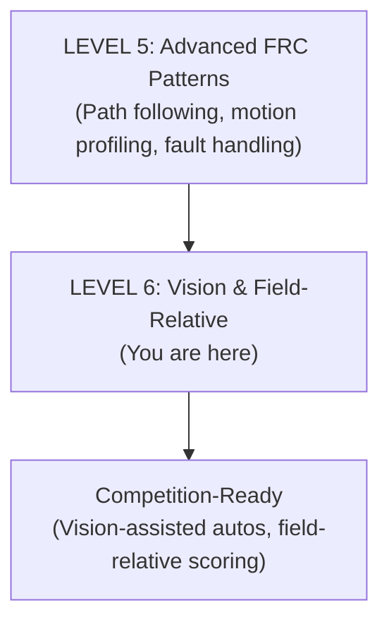

# **Guide to Java \- Level 6: Vision and Field-Relative Programming**

## **Who Is This For?**

FRC students who have completed Level 5 and are ready to add 3D vision to their autonomous routines. This guide covers AprilTag pose estimation with Limelight 4, fusing vision with odometry, and writing commands that operate in field coordinates.

**Prerequisites:** Level 5: Advanced FRC Patterns (comfortable with path following, motion profiling, command compositions, fault handling)

**Time to Complete:** 3–5 weeks; best done alongside a working swerve drivetrain

## **Your Learning Path**



---

## **Part 1: How Limelight 4 Sees the Field**

The Limelight 4 uses a Hailo neural-processing coprocessor to detect AprilTags at high speed. Unlike a laptop-based coprocessor, all computation happens on the camera itself — the robot just reads results over NetworkTables.

### **What the Camera Returns**

For each frame, the Limelight reports:

| Field | Meaning |
| :---- | :---- |
| `botpose_wpiblue` | Robot pose in WPILib field coordinates (Blue origin) |
| `botpose_wpired` | Same, but from the Red alliance origin |
| `tid` | ID of the primary tracked tag |
| `tl` | Pipeline latency (ms) |
| `cl` | Capture latency (ms) |
| `tv` | 1 if a valid target is visible, 0 otherwise |

The `botpose_wpiblue` array is `[x, y, z, roll, pitch, yaw, total_latency_ms, tag_count, tag_span, avg_tag_dist, avg_tag_area]`.

### **Configuring the Camera in Code**

Use `LimelightHelpers` (available from the Limelight vendor page) as a thin NetworkTables wrapper:

```java
import frc.robot.LimelightHelpers;
import frc.robot.LimelightHelpers.PoseEstimate;

public class VisionSubsystem extends SubsystemBase {

    private static final String CAMERA = "limelight";

    // Enable MegaTag2 (IMU-assisted, multi-tag). Must be called before each measurement.
    public void enableMegaTag2(double robotYawDegrees) {
        LimelightHelpers.SetRobotOrientation(
            CAMERA,
            robotYawDegrees, 0, 0,   // yaw, yaw rate, pitch, pitch rate, roll, roll rate
            0, 0
        );
    }

    public PoseEstimate getLatestEstimate() {
        return LimelightHelpers.getBotPoseEstimate_wpiBlue_MegaTag2(CAMERA);
    }

    public boolean hasTarget() {
        return LimelightHelpers.getTV(CAMERA);
    }
}
```

!!! note "Coach"
    <!-- category: common student misconception -->
    Students expect vision to be plug-and-play. It isn't. The camera must be mechanically rigid (no flex in the mount), the field layout JSON on the Limelight must match your event's AprilTag version (2024 tags ≠ 2025 tags), and the camera's physical offset from the robot center (`setCameraPose_RobotSpace`) must be measured accurately. Debug each of these before you even look at pose numbers.

??? info "Current FTC (2026)"
    <!-- category: ecosystem convergence -->
    **FTC AprilTag detection.** The FTC SDK 10.x includes a built-in `AprilTagProcessor` that returns tag pose in robot-relative coordinates. Limelight 3A and 4 are legal FTC hardware and return data via the same NetworkTables API used in FRC. Field-coordinate pose estimation in FTC is less common than in FRC, but the concepts — tag-to-robot transform, field layout JSON, latency — are identical. If your team uses a Limelight in FTC, everything in Parts 1–3 applies directly.

---

## **Part 2: MegaTag-Style Multi-Tag Solving**

A single tag gives an ambiguous 3D pose — from one tag you can't always tell if the camera is close-and-facing-forward or far-and-tilted. Two or more tags eliminate the ambiguity and also produce a more stable XY position estimate.

### **MegaTag1 vs. MegaTag2**

| | MegaTag1 | MegaTag2 |
| :---- | :---- | :---- |
| Input | One tag at a time | All visible tags simultaneously |
| IMU required | No | Yes (robot heading from gyro) |
| XY accuracy | Good when close | Better at distance |
| Rotation estimate | Often noisy | **Do not use** — use gyro instead |
| Best for | Single-tag fallback | Primary estimator on swerve |

MegaTag2 uses your gyro heading to constrain the solve, so it produces a much tighter XY estimate — but it relies on the gyro being correct. If the gyro drifts, the XY estimate drifts with it.

### **When Multi-Tag Helps (and Hurts)**

Multi-tag is better when:

- You're far from any single tag and need global position
- You're scoring on a structure with multiple nearby tags (e.g., Reef)

Multi-tag is worse when:

- Tags span a very wide angle and the geometry is degenerate
- Only one tag is visible anyway (the solver falls back to single-tag automatically)

!!! note "Coach"
    <!-- category: common student misconception -->
    The single most common MegaTag2 mistake is trusting its *rotation* output. MegaTag2 conditions the solve on the gyro heading — which means its rotation output is just your gyro heading echoed back. Use the gyro directly for heading; only take XY from MegaTag2. If you fuse the rotation from MegaTag2 you are creating a circular dependency.

---

## **Part 3: Fusing Vision Pose with Swerve Odometry**

`SwerveDrivePoseEstimator` works like `SwerveDriveOdometry` but adds a `addVisionMeasurement()` method that blends in periodic vision corrections using a Kalman filter.

### **Setting Up the Pose Estimator**

```java
import edu.wpi.first.math.estimator.SwerveDrivePoseEstimator;
import edu.wpi.first.math.VecBuilder;

// In DrivetrainSubsystem
private final SwerveDrivePoseEstimator poseEstimator = new SwerveDrivePoseEstimator(
    kinematics,
    getGyroAngle(),
    getModulePositions(),
    new Pose2d(),
    // Odometry standard deviations [x_m, y_m, heading_rad]
    VecBuilder.fill(0.05, 0.05, 0.01),
    // Vision standard deviations [x_m, y_m, heading_rad] — large = less trust
    VecBuilder.fill(0.5, 0.5, 9999)    // never trust vision heading
);
```

The standard deviations are noise estimates — lower values mean "trust this source more." For vision heading, use a very large number (e.g. 9999) to effectively ignore the camera's rotation output and rely only on the gyro.

### **Updating Odometry and Adding Vision Measurements**

```java
@Override
public void periodic() {
    // Always update from wheel encoders + gyro
    poseEstimator.update(getGyroAngle(), getModulePositions());

    // Pull the latest vision estimate and add it (if valid)
    vision.enableMegaTag2(getGyroAngle().getDegrees());
    var estimate = vision.getLatestEstimate();

    if (isValidEstimate(estimate)) {
        poseEstimator.addVisionMeasurement(
            estimate.pose,
            estimate.timestampSeconds,    // latency-compensated timestamp
            getVisionStdDevs(estimate)    // adaptive trust
        );
    }

    field2d.setRobotPose(getPose());
}

public Pose2d getPose() {
    return poseEstimator.getEstimatedPosition();
}

public void resetOdometry(Pose2d pose) {
    poseEstimator.resetPosition(getGyroAngle(), getModulePositions(), pose);
}
```

### **Validating and Adaptively Trusting Vision**

Not every vision measurement is trustworthy. Reject measurements that are clearly wrong before passing them to the estimator:

```java
private boolean isValidEstimate(LimelightHelpers.PoseEstimate estimate) {
    if (estimate == null) return false;
    if (estimate.tagCount == 0) return false;
    // Reject if pose is outside the field boundary (field is ~16.5 m × 8.2 m)
    if (estimate.pose.getX() < 0 || estimate.pose.getX() > 16.5) return false;
    if (estimate.pose.getY() < 0 || estimate.pose.getY() > 8.2) return false;
    // Reject if robot appears to be moving very fast (likely a tag flip artifact)
    double speed = drivetrain.getChassisSpeed().vxMetersPerSecond;
    if (Math.abs(speed) > 4.0 && estimate.avgTagDist > 3.0) return false;
    return true;
}

private Matrix<N3, N1> getVisionStdDevs(LimelightHelpers.PoseEstimate estimate) {
    // The further the tag, the less we trust position
    double distanceFactor = estimate.avgTagDist * estimate.avgTagDist;

    if (estimate.tagCount >= 2) {
        // Multi-tag: trust more
        return VecBuilder.fill(0.3 * distanceFactor, 0.3 * distanceFactor, 9999);
    } else {
        // Single tag: trust less
        return VecBuilder.fill(0.9 * distanceFactor, 0.9 * distanceFactor, 9999);
    }
}
```

!!! note "Coach"
    <!-- category: let them fail here -->
    Let students pick stdDevs by intuition once. They will almost always make vision too trusted (small stdDevs) and the robot will jerk when tags appear or disappear. After they see this, have them log vision error vs. odometry error over several test runs and pick values empirically. Five minutes of logging saves an hour of guessing.

??? info "Current FTC (2026)"
    <!-- category: ecosystem convergence -->
    **FTC pose fusion.** FTC teams using Road Runner or Pedro Pathing rely entirely on dead-wheel odometry for pose — there is no equivalent of `addVisionMeasurement`. In the converging FTC/FRC ecosystem, a Kalman-filter pose estimator is a planned addition to the FTC SDK. For now, FTC students reading this level should understand the concept: wheel odometry drifts; vision corrects it periodically; the filter weighs each source by its expected noise.

---

## **Part 4: Latency Compensation**

A Limelight measurement takes time to arrive. By the time the robot reads `botpose_wpiblue`, the robot has moved. WPILib's pose estimator automatically back-projects the correction if you pass the correct timestamp.

### **Where the Latency Comes From**

```
Camera captures frame
    │
    ▼  (pipeline latency: tag detection + solve)
Limelight posts result to NetworkTables
    │
    ▼  (network latency: ~1–2 ms on a wired connection)
Robot code reads the result
    │
    ▼  Total: typically 30–80 ms
```

Limelight provides both components:

```java
// Total latency in milliseconds
double totalLatencyMs = estimate.latency;

// Reconstruct the timestamp of when the frame was captured
double captureTimestampSeconds = Timer.getFPGATimestamp() - (totalLatencyMs / 1000.0);
```

`LimelightHelpers.getBotPoseEstimate_wpiBlue_MegaTag2()` fills `estimate.timestampSeconds` with this value automatically — you do not need to compute it manually if you use that helper.

### **Why It Matters**

Without compensation, if the robot is moving quickly (say, 3 m/s) and the latency is 50 ms, the robot has moved 0.15 m since the frame was captured. Applying the measurement to the current timestamp shifts the pose estimate 0.15 m in the wrong direction. With compensation, the estimator back-projects the correction to where the robot *was* at capture time, which is correct.

```java
// Correct: pass the capture timestamp, not the current time
poseEstimator.addVisionMeasurement(
    estimate.pose,
    estimate.timestampSeconds,  // when the frame was captured
    stdDevs
);
```

!!! note "Coach"
    <!-- category: real-robot demo opportunity -->
    Demo this live: place the robot in an auto routine, then wave your hand in front of the camera for one second to block the tag. With latency compensation the pose estimate holds steady via odometry and then smoothly converges when the tag reappears. Without compensation (or with naively using the current timestamp), the convergence jerk is visible. Students remember what they see.

---

## **Part 5: Field-Relative Drive and Scoring Commands**

Field-relative drive means joystick "forward" always moves the robot toward the opposing alliance wall — regardless of which direction the robot is pointing. This requires translating joystick inputs from field coordinates to robot-relative chassis speeds using the robot's current heading.

### **Field-Relative Chassis Speeds**

```java
// In DrivetrainSubsystem
public void driveFieldRelative(double xFieldSpeed, double yFieldSpeed, double omega) {
    ChassisSpeeds robotRelative = ChassisSpeeds.fromFieldRelativeSpeeds(
        xFieldSpeed,
        yFieldSpeed,
        omega,
        getPose().getRotation()   // current heading from pose estimator
    );
    driveRobotRelative(robotRelative);
}
```

### **Teleop Field-Relative Command**

```java
public static Command fieldRelativeDrive(
    DrivetrainSubsystem drivetrain,
    DoubleSupplier xSupplier,
    DoubleSupplier ySupplier,
    DoubleSupplier omegaSupplier
) {
    return drivetrain.run(() -> {
        // Apply a deadband and square the inputs for better driver feel
        double x = MathUtil.applyDeadband(xSupplier.getAsDouble(), 0.08);
        double y = MathUtil.applyDeadband(ySupplier.getAsDouble(), 0.08);
        double omega = MathUtil.applyDeadband(omegaSupplier.getAsDouble(), 0.08);

        drivetrain.driveFieldRelative(
            x * DriveConstants.MAX_SPEED_MPS,
            y * DriveConstants.MAX_SPEED_MPS,
            omega * DriveConstants.MAX_ANGULAR_SPEED_RPS
        );
    });
}
```

Set this as the drivetrain's default command in `RobotContainer`:

```java
drivetrain.setDefaultCommand(
    DriveCommands.fieldRelativeDrive(
        drivetrain,
        () -> -driver.getLeftY(),   // forward/back (negate for WPILib convention)
        () -> -driver.getLeftX(),   // strafe
        () -> -driver.getRightX()   // rotate
    )
);
```

### **"Drive to Nearest Scoring Location" Command**

Field-relative commands can also drive autonomously to a field coordinate — for example, aligning the robot to the nearest Reef branch before a score.

```java
import edu.wpi.first.math.controller.ProfiledPIDController;
import edu.wpi.first.math.geometry.Pose2d;
import edu.wpi.first.math.geometry.Rotation2d;
import edu.wpi.first.math.trajectory.TrapezoidProfile;

public class DriveToNearestScoringLocation extends Command {

    private static final List<Pose2d> REEF_BRANCHES = List.of(
        new Pose2d(3.0, 4.1, Rotation2d.fromDegrees(180)),  // example coordinates
        new Pose2d(3.0, 3.5, Rotation2d.fromDegrees(180)),
        new Pose2d(3.5, 3.2, Rotation2d.fromDegrees(150))
        // ... all reef branch poses
    );

    private final DrivetrainSubsystem drivetrain;
    private Pose2d target;

    private final ProfiledPIDController xController =
        new ProfiledPIDController(5, 0, 0, new TrapezoidProfile.Constraints(3.0, 4.0));
    private final ProfiledPIDController yController =
        new ProfiledPIDController(5, 0, 0, new TrapezoidProfile.Constraints(3.0, 4.0));
    private final ProfiledPIDController rotController =
        new ProfiledPIDController(4, 0, 0, new TrapezoidProfile.Constraints(Math.PI, Math.PI * 2));

    public DriveToNearestScoringLocation(DrivetrainSubsystem drivetrain) {
        this.drivetrain = drivetrain;
        rotController.enableContinuousInput(-Math.PI, Math.PI);
        addRequirements(drivetrain);
    }

    @Override
    public void initialize() {
        Pose2d current = drivetrain.getPose();
        // Find the nearest reef branch
        target = REEF_BRANCHES.stream()
            .min(Comparator.comparingDouble(p -> p.getTranslation()
                .getDistance(current.getTranslation())))
            .orElseThrow();

        xController.reset(current.getX());
        yController.reset(current.getY());
        rotController.reset(current.getRotation().getRadians());
    }

    @Override
    public void execute() {
        Pose2d current = drivetrain.getPose();
        drivetrain.driveFieldRelative(
            xController.calculate(current.getX(), target.getX()),
            yController.calculate(current.getY(), target.getY()),
            rotController.calculate(current.getRotation().getRadians(),
                                    target.getRotation().getRadians())
        );
    }

    @Override
    public boolean isFinished() {
        return xController.atGoal() && yController.atGoal() && rotController.atGoal();
    }

    @Override
    public void end(boolean interrupted) {
        drivetrain.stop();
    }
}
```

Bind it to a button in `RobotContainer`:

```java
driver.x().whileTrue(new DriveToNearestScoringLocation(drivetrain));
```

---

## **Part 6: Vision-Dropout Recovery and Graceful Degradation**

Vision is unreliable during a match — tags are blocked, the camera is bumped, the robot spins too fast for the solver to keep up. The robot must continue to function correctly when vision is unavailable.

### **Dropout Detection**

```java
public class VisionSubsystem extends SubsystemBase {

    private static final double DROPOUT_THRESHOLD_SECONDS = 0.5;

    private double lastValidTimestamp = 0;

    @Override
    public void periodic() {
        var estimate = getLatestEstimate();
        if (estimate != null && estimate.tagCount > 0) {
            lastValidTimestamp = Timer.getFPGATimestamp();
        }
    }

    public boolean isDroppedOut() {
        return (Timer.getFPGATimestamp() - lastValidTimestamp) > DROPOUT_THRESHOLD_SECONDS;
    }

    public double getSecondsSinceLastUpdate() {
        return Timer.getFPGATimestamp() - lastValidTimestamp;
    }
}
```

### **Adapting Autonomous Behavior**

A vision-assisted path-following routine should:

1. Run normally when vision is healthy
2. Fall back to odometry-only when vision drops out
3. Resume vision corrections automatically when tags reappear

```java
public static Command visionAssistedPath(
    DrivetrainSubsystem drivetrain,
    VisionSubsystem vision,
    String trajName
) {
    return Commands.sequence(
        // Log a warning if vision is already dropped out at the start
        Commands.runOnce(() -> {
            if (vision.isDroppedOut()) {
                DriverStation.reportWarning("Vision dropout at auto start — running odometry only", false);
            }
        }),
        AutonomousCommands.followPath(drivetrain, trajName)
        // The pose estimator handles vision dropout automatically:
        // addVisionMeasurement() simply isn't called when there are no valid estimates,
        // so odometry carries the pose until vision recovers.
    );
}
```

### **Re-Seeding After a Known-Good Pose**

When the robot starts a match, its position is known exactly. After a dropout-heavy auto, the accumulated drift may be significant. One pattern is to re-seed the estimator when a fresh high-quality measurement arrives (multiple tags, close distance):

```java
private void maybeReseedPose(LimelightHelpers.PoseEstimate estimate) {
    boolean highQuality = estimate.tagCount >= 3 && estimate.avgTagDist < 1.5;
    boolean significantDrift = getPose().getTranslation()
        .getDistance(estimate.pose.getTranslation()) > 0.3;

    if (highQuality && significantDrift) {
        // Hard reset — use sparingly; can cause visible jumps
        resetOdometry(estimate.pose);
    }
}
```

!!! note "Coach"
    <!-- category: let them fail here -->
    Students almost always start by hard-resetting the pose on every frame. The robot twitches visibly as the pose jumps with each new measurement. Let them observe this, then introduce the pose estimator's blending approach as the solution. The contrast makes the Kalman filter intuition stick.

---

## **Capstone: Vision-Assisted Two-Piece Auto**

This capstone builds a complete two-piece autonomous routine that uses Level 5 path following, motion profiling from Level 5 Part 7, and vision corrections from this level. It degrades gracefully if vision drops out.

### **`VisionPoseUpdater.java`**

A dedicated subsystem that owns vision-to-pose-estimator integration:

```java
public class VisionPoseUpdater extends SubsystemBase {

    private final DrivetrainSubsystem drivetrain;
    private final VisionSubsystem vision;

    public VisionPoseUpdater(DrivetrainSubsystem drivetrain, VisionSubsystem vision) {
        this.drivetrain = drivetrain;
        this.vision = vision;
    }

    @Override
    public void periodic() {
        // Provide current heading to MegaTag2 solver
        vision.enableMegaTag2(drivetrain.getGyroAngle().getDegrees());

        var estimate = vision.getLatestEstimate();
        if (drivetrain.isValidEstimate(estimate)) {
            drivetrain.addVisionMeasurement(
                estimate.pose,
                estimate.timestampSeconds,
                drivetrain.getVisionStdDevs(estimate)
            );
        }
    }
}
```

### **`AutonomousRoutines.java` (Vision-Assisted)**

```java
public final class AutonomousRoutines {

    private AutonomousRoutines() {}

    /**
     * Score preloaded piece, collect from source, score second piece.
     * Applies vision corrections whenever tags are visible.
     * Falls back to odometry automatically during dropouts.
     */
    public static Command scoreTwoPieceVision(
        DrivetrainSubsystem drivetrain,
        ElevatorSubsystem elevator,
        IntakeSubsystem intake,
        VisionSubsystem vision
    ) {
        return Commands.sequence(

            // ── Piece 1 ──────────────────────────────────────────────────────
            Commands.parallel(
                // Drive to scoring position
                AutonomousCommands.followPath(drivetrain, "StartToReef1"),
                // Stage elevator while driving (saves ~0.4 s)
                ElevatorCommands.goTo(elevator, ElevatorPosition.L3)
                    .unless(() -> !elevator.isHealthy())
            ),
            IntakeCommands.feed(intake).withTimeout(0.5),

            // ── Travel to source ─────────────────────────────────────────────
            Commands.parallel(
                AutonomousCommands.followPath(drivetrain, "Reef1ToSource"),
                ElevatorCommands.goTo(elevator, ElevatorPosition.INTAKE)
            ),
            IntakeCommands.run(intake).until(intake::hasPiece).withTimeout(2.0),

            // ── Piece 2 ──────────────────────────────────────────────────────
            Commands.parallel(
                AutonomousCommands.followPath(drivetrain, "SourceToReef2"),
                ElevatorCommands.goTo(elevator, ElevatorPosition.L4)
                    .unless(() -> !elevator.isHealthy())
            ),
            IntakeCommands.feed(intake).withTimeout(0.5),

            // Stow and stop
            ElevatorCommands.goTo(elevator, ElevatorPosition.STOWED)
        );
    }
}
```

### **Key Design Decisions**

| Decision | Rationale |
| :---- | :---- |
| Vision updating runs in `VisionPoseUpdater.periodic()` | Decouples vision from drivetrain; path follower reads corrected pose transparently |
| `unless(() -> !elevator.isHealthy())` guards | If the elevator faults, skip staging — robot still drives the path and scores at current height |
| No explicit vision guard in auto | `addVisionMeasurement()` is a no-op when called with bad data; the filter handles dropout automatically |
| Timestamps from `estimate.timestampSeconds` | Latency compensation is always on — the estimator back-projects corrections correctly |

### **Try This**

- Add a `sendable` chooser in `RobotContainer` that offers "Vision Auto" vs. "Odometry-Only Auto" for events where the field has damaged tags
- Tune the stdDevs by logging `drivetrain.getPose()` vs. raw vision pose across several test runs and computing average error at different distances
- Add a `ShuffleboardTab` that shows: last vision update age, tag count, current pose, estimated error

---

## **Reference Card**

| Concept | Key Class / Method | Notes |
| :---- | :---- | :---- |
| Vision pose reading | `LimelightHelpers.getBotPoseEstimate_wpiBlue_MegaTag2()` | Call after `SetRobotOrientation()` |
| MegaTag2 orientation | `LimelightHelpers.SetRobotOrientation()` | Pass current gyro heading each loop |
| Pose estimator | `SwerveDrivePoseEstimator` | Drop-in replacement for `SwerveDriveOdometry` |
| Vision fusion | `poseEstimator.addVisionMeasurement(pose, timestamp, stdDevs)` | Use `estimate.timestampSeconds`, not current time |
| Standard deviations | `VecBuilder.fill(x, y, rot)` | Lower = more trust; never trust vision rotation |
| Field-relative speeds | `ChassisSpeeds.fromFieldRelativeSpeeds()` | Pass `getPose().getRotation()` as heading |
| Dropout detection | Compare `Timer.getFPGATimestamp()` vs. last valid timestamp | Use to warn drivers; estimator handles it automatically |

---

## **What's Next?**

You have now completed the full progression from Java basics to competition-level vision-assisted robotics. The patterns in this handbook are what top-10% FRC teams use every season.

| Level 6 Skill | Where to Go Next |
| :---- | :---- |
| Vision pose estimation | Explore PhotonVision as an alternative coprocessor; compare accuracy at distance |
| Pose estimator / Kalman filter | Study AdvantageKit's logging-first approach to debugging estimator state |
| Field-relative scoring commands | Add vision-alignment fine-correction on top of path-following (two-stage: coarse path, fine vision snap) |
| Graceful degradation | Build fault trees for every sensor on the robot; practice "sensor unplugged" drills before competition |
| Full command-based + vision | Read and contribute to your team's competition codebase — you have the tools |